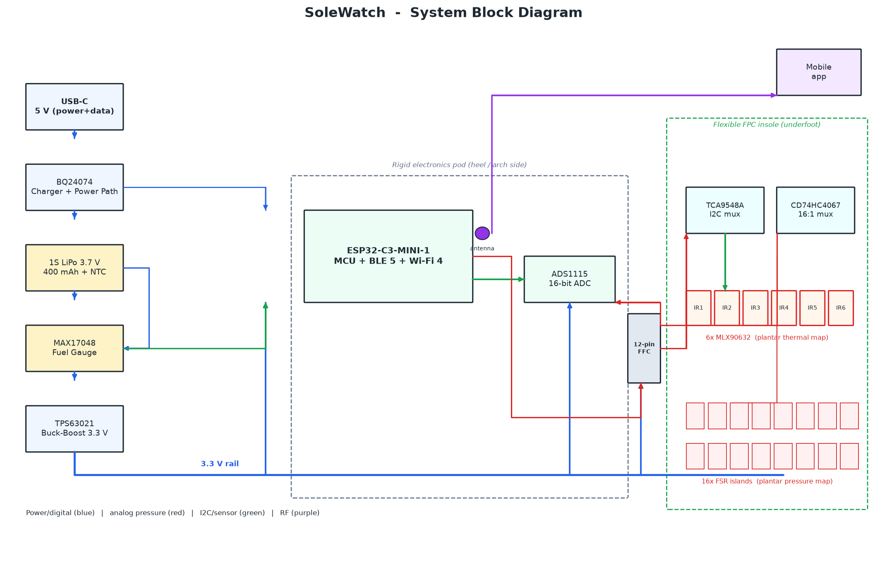
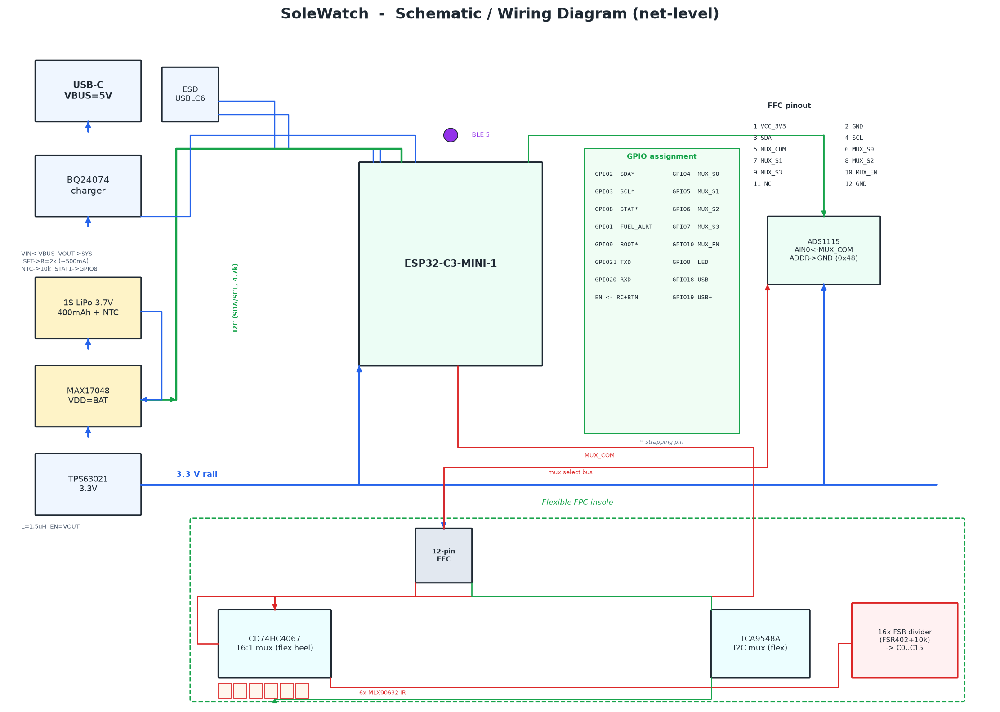
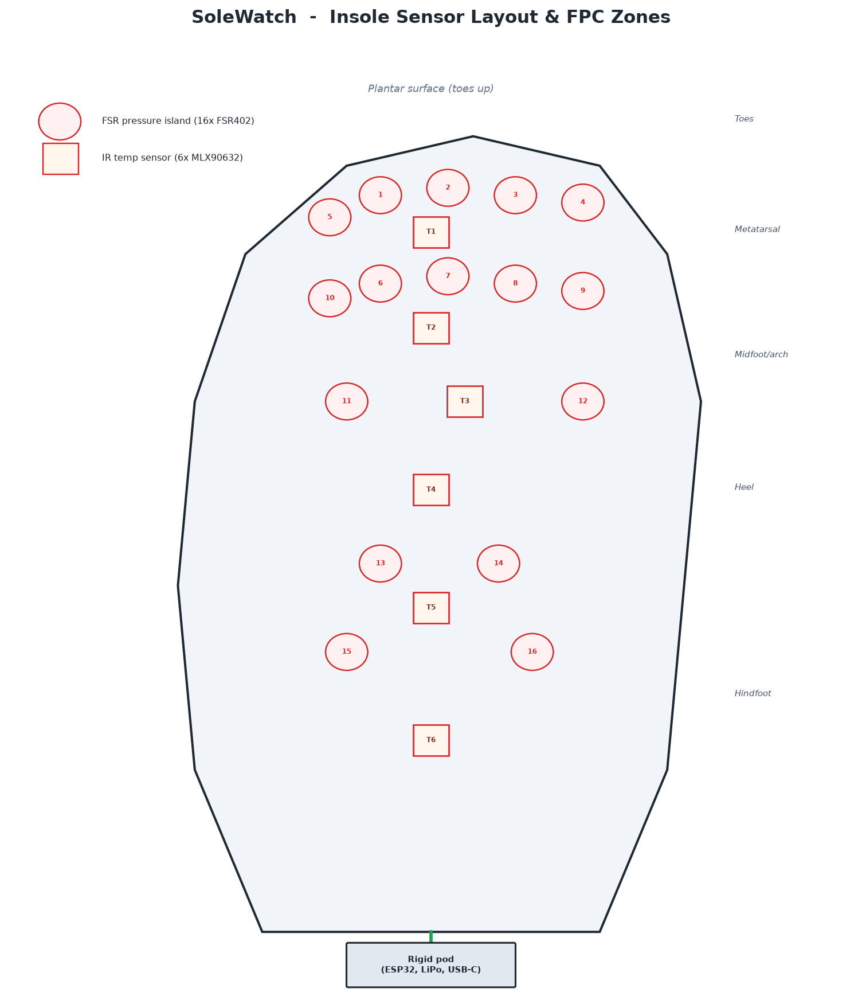

# SoleWatch: A Plantar Pressure & Thermal Sensing Research Platform
### Electrical Engineering & Quantum Information Physics — Independent Research Guide

**Document type:** Consolidated engineering guide (merges and supersedes all prior drafts listed in the Revision Note below)
**Structure:** 60% Electrical Engineering · 40% Quantum Engineering
**Revision:** 2.0 (Consolidated)
**Prepared for:** Independent research portfolio — Oxford, Cambridge, Duke, Stanford, University of Michigan, Georgia Institute of Technology

---

## Revision Note — what this document is and where everything came from

This guide consolidates every SoleWatch document produced so far into one coherent reference:

1. The original project guide (build sequence, Arduino sketches 1–9, admissions strategy, nonprofit roadmap)
2. The improvements/BOM research pass (component sourcing, budget breakdown, literature grounding)
3. The advanced hardware design package (16-FSR / 6-IR flex-PCB architecture, schematic, GPIO map)
4. The embedded firmware architecture draft (bilateral sensor fusion, BLE telemetry, power state machine)
5. The three system diagrams (block diagram, schematic, insole sensor layout)

Two things were **changed**, not just merged, and it's worth being upfront about both:

**First — terminology.** Draft #4 in particular used clinical vocabulary in a few places (`clinical_confirmed`, "clinical risk signals," framing the 2.2 °C figure as a "clinical decision boundary" in some section headers even while disclaiming it elsewhere). This guide standardizes on one consistent frame throughout, in code comments as much as prose: SoleWatch is a **research and engineering instrument**, the 2.2 °C bilateral-asymmetry figure from the literature is a **cited reference point for comparison and discussion**, and every threshold crossing is an **experimental/statistical flag**, never a diagnosis, medical alert, or clinical decision. This isn't a cosmetic change — every one of your own source documents that discusses it directly (including draft #4's own §1 and §13) agrees this is the accurate and defensible framing; this revision just makes it consistent everywhere instead of only in the disclaimer paragraphs. It also happens to be the stronger admissions story — see Part 9.

**Second — scope, for the actual code.** The advanced hardware package specifies 16 FSRs and 6 IR sensors across a two-board flex-PCB system. The complete firmware requested for this revision targets the simpler, actually-buildable **4 FSR + 1 MLX90614** configuration on standard ESP32 dev boards — this is Phase A in the build sequence below. The 16/6-sensor flex-PCB design is retained in full as the Phase B / advanced reference architecture (Part 3), since it's excellent, real engineering work worth having in the portfolio — it's just not what the complete, compilable code in Part 5 targets. Building Phase A first and treating Phase B as the documented "if I had a fabrication budget and more time" extension is also, honestly, the more credible story for an interview: a working breadboard prototype you can defend in detail beats an undeployed 16-channel flex-PCB design you haven't built yet.

---

### Table of Contents

- [Part 0 — Project Framing](#part-0--project-framing-read-this-first)
- [Part 1 — System Overview](#part-1--system-overview)
- [Part 2 — Bill of Materials](#part-2--bill-of-materials)
- [Part 3 — Advanced Hardware Architecture (Phase B)](#part-3--advanced-hardware-architecture-phase-b-reference-design)
- [Part 4 — Mathematical Derivations & Signal Theory](#part-4--mathematical-derivations--signal-theory-60-electrical-engineering)
  - 4.1 Voltage-divider sensitivity optimization
  - 4.2 Cross-sensitivity (temperature) correction
  - 4.3 Discrete-time moving-average filtering
- [Part 5 — Complete Embedded Firmware](#part-5--complete-embedded-firmware-arduino-ide--esp32)
- [Part 6 — Quantum Engineering Module](#part-6--quantum-engineering-module-40-quantum-engineering)
  - 6.1 Comparative essay: SNSPDs vs. classical FSRs
  - 6.2 Complete IBM Qiskit variational quantum classifier
- [Part 7 — Literature Foundation](#part-7--literature-foundation)
- [Part 8 — Calibration & Experimental Protocol](#part-8--calibration--experimental-protocol)
- [Part 9 — Dual Admissions Strategy & Non-Profit Roadmap](#part-9--dual-admissions-strategy--non-profit-roadmap)
- [Part 10 — Responsible Use & Safety Boundaries](#part-10--responsible-use--safety-boundaries)
- [Appendix — Consolidated References](#appendix--consolidated-references)

---

## Part 0 — Project Framing (read this first)

> **What SoleWatch is:** an electrical engineering research platform that measures plantar pressure and skin temperature, applies real signal-processing and statistics to those measurements, and flags when a reading is a statistical outlier relative to *that specific wearer's own logged baseline*.
>
> **What SoleWatch is not:** a certified medical device, a diagnostic tool, or a source of health advice. It has not been clinically validated. Nothing it outputs should be used to make a real decision about anyone's foot care, footwear, or treatment.
>
> **Why it's built this way anyway:** the project is genuinely inspired by diabetic foot complications — a family member's experience, per the original framing — and there's nothing dishonest about saying so. What would be dishonest (and what this document avoids) is implying that an uncalibrated hobbyist sensor built on a breadboard has been shown to detect or predict a real medical condition. Both things are true at once: this is legitimate, citable engineering research *and* it is not, and should not be presented as, healthcare technology. Part 9 and Part 10 cover exactly how to talk about it in each context — application essays, an interview, and (if it ever gets there) actual human testing.

Every section below follows this framing. If you're skimming: the rule of thumb is that any output this device produces gets called a **flag** (or "statistical/engineering flag"), never an **alert** in the clinical sense, and the word **diagnosis** does not appear anywhere in this project's vocabulary.

---

## Part 1 — System Overview

### 1.1 The problem this instrument is designed to study

Diabetic peripheral neuropathy gradually reduces sensation in the feet. Someone with advanced neuropathy can develop a pressure sore or a small wound and not feel it, because the pain-based warning system that would normally catch it has stopped working. Combined with the circulation issues common in diabetes, an unnoticed injury like this is a well-documented pathway to diabetic foot ulcers. The engineering question that motivates SoleWatch is narrower than "solve this problem" — it's: **can a low-cost sensor array reconstruct, with known and quantified uncertainty, the two physical signals (sustained localized pressure and localized skin-temperature elevation) that a healthy nerve would otherwise report?** That's a real, well-scoped instrumentation problem, answerable with data, independent of any clinical claim about what a device built to explore it would be safe or effective to actually deploy.

### 1.2 How the instrument is structured

SoleWatch places sensors at the plantar sites most discussed in the pressure/thermography literature (Part 7) — heel, first and fifth metatarsal heads, and the hallux, in the base build — and continuously logs two quantities at each site: filtered pressure-proportional voltage and, from a shared IR temperature sensor, localized skin temperature. A microcontroller compares each site (a) against that same site's own statistically-established baseline, and, when two matched boards are worn, (b) against the mirrored site on the other foot. Side-to-side comparison is a more defensible signal than any single absolute reading, because baseline foot temperature and pressure vary enormously from person to person — comparing a foot to itself, or to its own mirror image, sidesteps that entirely. This is standard practice in the literature this project cites (Part 7), not a shortcut invented for this build.

### 1.3 System block diagram

The diagram below shows the **advanced/production architecture** (Part 3) — the full 16-FSR + 6-IR two-substrate design. The **Phase A breadboard build** that Part 5's complete code targets is the same signal flow with a single ESP32, 4 FSRs, and 1 MLX90614 in place of the flex-PCB sensor array and ADS1115/mux front end; Part 3.0 below shows exactly how the two map onto each other.



**Signal flow legend** — blue = power/digital, green = I2C/sensor, red = analog pressure, purple = RF.

### 1.4 Two build phases, one consistent architecture

| | **Phase A — Research Breadboard** (Part 5 gives complete code for this) | **Phase B — Advanced / Flex-PCB Architecture** (Part 3, documented reference design) |
|---|---|---|
| Pressure sensors | 4× FSR402 | 16× FSR402 islands |
| Temperature sensors | 1× MLX90614 (shared across sites) | 6× MLX90632 (per-zone) |
| MCU | ESP32 Dev Module ×1 or ×2 (bilateral) | ESP32-C3-MINI-1, two nodes |
| Substrate | Breadboard + insole blank | Flex PCB insole + rigid pod |
| Comms | ESP-NOW (board-to-board), Serial (to laptop) | BLE 5 GATT (to phone app) |
| Cost | ~$80–180 (Part 2.1) | ~$220–260 prototype, ~$45–65 at volume (Part 2.2) |
| Status | **Build this first.** Fully coded, testable this week. | Aspirational / "if I had a fab budget" reference — real, cited, complete design; not the build target of Part 5's code |

Starting with Phase A and being able to explain every line of the working prototype in an interview is worth more than an unbuilt Phase B design — see Part 9 on why this specific ordering is also the stronger admissions story.


---

## Part 2 — Bill of Materials

### 2.1 Phase A — Research Breadboard (what Part 5's code targets)

| Item | Qty | Approx. price | Notes |
|---|---|---|---|
| ESP32 Dev Module (USB-C or micro-USB, CP2102/CH340) | 1 (or 2 for bilateral) | $10–14 each | Any ESP32 (not ESP32-S2/C3-only board) works; needs 2 ADC1-capable analog pins minimum, 4 used here |
| Interlink FSR 402, 0.5" round | 4 (×2 boards = 8) | $7–11 each | [Interlink datasheet](https://www.interlinkelectronics.com/fsr-402); DigiKey or SparkFun |
| MLX90614 IR temperature sensor breakout, 3.3 V version | 1 per board | $15–20 | Adafruit #1748 or SparkFun equivalent — **use the 3.3 V-labeled version**, not 5 V, on an ESP32 |
| 10 kΩ resistor (1%, or a multi-pack) | 4 per board | ~$0.10 each | FSR divider pull-down — see Part 4.1 for why this value, and how to optimize it |
| Full-size solderless breadboard | 1 per board | $5–10 | |
| Jumper wire kit (M-M, M-F) | 1 kit | $5–10 | |
| 220 Ω resistor pack | 1 pack | $3 | LED current limiting |
| 3× 5 mm LEDs (green, yellow, red) | 3 per board | $2–5 total | Status indicator per Part 5 §10 |
| Passive piezo buzzer | 1 per board | $2–5 | |
| USB cable (data-capable) | 1–2 | $4–8 | For programming + serial logging |
| Trim-to-fit EVA foam insole blank | 1 per board | $8–15 | |
| Fabric athletic tape | 1 roll | $4–8 | Non-permanent sensor retention — never a hard adhesive bump under the sensing area |
| Small project box (optional) | 1 per board | $6–12 | Keeps the ESP32/breadboard outside the shoe during testing |

**Total, single board: ~$65–110. Two boards for bilateral comparison: ~$120–200** — comfortably inside a $75–450 budget with room left for a nicer enclosure or the optional ADS1115 upgrade below.

**Optional upgrade:** an **ADS1115** 16-bit I2C ADC (~$10–15, Adafruit/SparkFun) gives cleaner, higher-resolution pressure readings than the ESP32's native ADC, which is real but non-ideal (documented nonlinearity, see Part 4.3). Not required for Part 5's code to work — the ESP32's built-in 12-bit ADC is used directly — but a natural "version 1.1" upgrade, and it's the same part the Phase B architecture uses at scale.

No fixed purchase links are given here on purpose — listings and prices shift within weeks. Search the exact part names above on **Adafruit, SparkFun, DigiKey, or Amazon** and compare current listings; Adafruit and SparkFun both include wiring guides for each part.

### 2.2 Phase B — Advanced / Flex-PCB Architecture (reference design, Part 3)

Costs below are indicative single-unit USD pricing for prototype quantities from major distributors (DigiKey/Mouser/Adafruit).

| # | Reference | Part / MPN | Function | Qty | Unit (USD) | Ext (USD) |
|---|---|---|---|---|---|---|
| 1 | U1 | ESP32-C3-MINI-1 | MCU + BLE 5 + Wi-Fi 4 | 1 | 3.50 | 3.50 |
| 2 | U2 | ADS1115 (PW/VQFN) | 16-bit ADC, I2C | 1 | 5.95 | 5.95 |
| 3 | U3 | CD74HC4067 | 16:1 analog mux | 1 | 1.20 | 1.20 |
| 4 | U4 | TCA9548A | 8-ch I2C mux | 1 | 1.95 | 1.95 |
| 5 | U5–U10 | MLX90632 (QFN-4) | IR thermopile, ±0.2 °C | 6 | 9.95 | 59.70 |
| 6 | U11 | BQ24074 (VQFN-16) | 1.5 A charger w/ power path | 1 | 2.40 | 2.40 |
| 7 | U12 | TPS63021 (VQFN-10) | 3.3 V buck-boost | 1 | 3.20 | 3.20 |
| 8 | U13 | MAX17048 (TDFN-8) | LiPo fuel gauge | 1 | 4.95 | 4.95 |
| 9 | FSR1–FSR16 | Interlink FSR 402 | force-sensing resistor | 16 | 7.00 | 112.00 |
| 10 | J1 | USB-C 16-pin SMT | power + data input | 1 | 1.50 | 1.50 |
| 11 | J2 | Hirose FH12-12S (0.5 mm FFC) | flex-to-rigid connector (×2) | 2 | 1.80 | 3.60 |
| 12 | BAT1 | 1S LiPo 3.7 V 400 mAh | battery (with NTC) | 1 | 6.50 | 6.50 |
| 13 | L1 | 1.5 µH 2A inductor (0805) | TPS63021 inductor | 1 | 0.40 | 0.40 |
| 14 | RT1 | 10 kΩ NTC thermistor | battery temp (BQ24074 TS) | 1 | 0.30 | 0.30 |
| 15 | R1–R16 | 10 kΩ 1% 0603 | FSR divider pull-downs | 16 | 0.05 | 0.80 |
| 16 | R_ISET | 2 kΩ 1% 0603 | BQ24074 charge-current set | 1 | 0.05 | 0.05 |
| 17 | R_PU | 4.7 kΩ 1% 0603 | I2C pull-ups (×3 sets) | 8 | 0.05 | 0.40 |
| 18 | C1–C16 | 1 nF 0603 | per-channel anti-alias | 16 | 0.05 | 0.80 |
| 19 | Cbulk | 10 µF / 0.1 µF 0603 | decoupling per rail | 6 | 0.10 | 0.60 |
| 20 | LED1 | 0603 LED | status | 1 | 0.15 | 0.15 |
| 21 | SW1 | tactile switch | BOOT/EN | 2 | 0.20 | 0.40 |
| 22 | PCB | polyimide flex insole + rigid pod | fabrication (prototype) | 1 set | 25.00 | 25.00 |
| | | | **TOTAL (per foot, qty-1 pricing)** | | | **≈ $236** |

**Prototype cost: ~$220–260 per foot**, dominated by the 16× FSR402 (~$112) and 6× MLX90632 (~$60). At production volumes (1k+ units) the per-unit BOM drops to roughly **$45–65**.

---

## Part 3 — Advanced Hardware Architecture (Phase B reference design)

*This entire section documents the flex-PCB, 16-FSR/6-IR production architecture. It's real, cited, datasheet-verified engineering — worth including in a portfolio or GitHub repo in full — but it is the aspirational Phase B design, not what Part 5's complete firmware targets. If you only want the buildable Phase A system, skip to Part 4.*

### 3.0 How Phase A maps onto this architecture

Phase A is this exact signal chain with the channel count turned down and the flex PCB replaced by a breadboard + insole blank:

| Phase B block | Phase A equivalent |
|---|---|
| 16× FSR islands → CD74HC4067 mux → ADS1115 ADC | 4× FSR → 4 direct ESP32 ADC1 pins (no mux needed at this channel count) |
| 6× MLX90632 → TCA9548A mux | 1× MLX90614, no mux needed (single sensor) |
| Two ESP32-C3 nodes ↔ BLE 5 GATT | Two ESP32 dev boards ↔ ESP-NOW (Part 5 §9) |
| BQ24074 + TPS63021 + MAX17048 power chain | USB cable power during bench testing; add a LiPo + charger module only once you're ready for a wireless enclosure |

### 3.1 System overview

SoleWatch (Phase B) is a dual-purpose plantar health monitoring insole that maps **distributed foot pressure** (16 force-sensing resistor islands) and **plantar skin temperature** (6 infrared thermopile sensors) and streams the fused data over **Bluetooth Low Energy (BLE 5)** to a mobile companion app. The electronics are split across two physically distinct substrates:

| Substrate | Location | Function |
|---|---|---|
| **Flexible FPC insole** | Underfoot, inside the shoe | 16 FSR pressure islands, 6 MLX90632 IR sensors, analog mux, I2C mux |
| **Rigid electronics pod** | Heel/arch exterior of shoe | ESP32-C3 MCU, charger, fuel gauge, buck-boost, ADC, USB-C |

The two substrates are joined by a **12-pin 0.5 mm-pitch FFC ribbon** (Hirose FH12-class), letting the rigid pod be serviced or replaced without disturbing the flex insole.

**Design goals:** <3 mm total in-shoe stackup, IP65 splash target, full 16-point pressure frame at ≥50 Hz, ±0.2 °C sensor accuracy, single-charge runtime >12 h.

### 3.2 Detailed schematic / wiring diagram



Power enters at USB-C (5 V VBUS), passes through the **BQ24074** charger with power-path management and NTC thermistor protection into the **1S 3.7 V 400 mAh LiPo**. The **MAX17048** fuel gauge monitors battery state over I2C. The battery bus feeds the **TPS63021** buck-boost, which regulates a clean **3.3 V system rail** powering the ESP32-C3, ADS1115, and (through the FFC) the flex-side muxes and sensors. On the logic side, the ESP32-C3 reads pressure via a **CD74HC4067 16:1 analog mux → ADS1115 16-bit ADC** (I2C), and reads temperature via a **TCA9548A I2C mux** distributing one I2C bus to 6 same-address **MLX90632** sensors.

### 3.3 Sensor architecture

**Pressure — 16 discrete FSR islands (not a matrix).** Each plantar pressure point uses an **Interlink FSR 402** (Ø14.7 mm active area, 0.2–20 N useful range) wired as a voltage divider with a 10 kΩ pull-down to 3.3 V. All 16 divider outputs feed a **CD74HC4067 16:1 analog mux**, captured by an **ADS1115 16-bit ADC** over I2C. Discrete islands were chosen over a row/column matrix specifically to avoid crosstalk, ghosting, and diode-shunting complexity — a matrix would need diode isolation per node to prevent phantom readings, at the cost of the dynamic range gait analysis needs. At 860 SPS across 16 muxed channels, effective full-frame rate is **≈52 Hz**, comfortably above the ~20 Hz walking-gait analysis needs.

**Temperature — 6× MLX90632 IR thermopiles.** The MLX90614 (used in Phase A) is a TO-39 metal can, 4.8 mm tall — too tall and rigid for a <3 mm in-shoe flex stack. The **MLX90632** is the SMD-package functional equivalent: 3×3×1 mm QFN, 3.3 V, 50° FOV, ±0.2 °C accuracy, I2C. All six share I2C address 0x3A, so a **TCA9548A 8-channel I2C mux** selects one at a time.

### 3.4 MCU & GPIO assignment

The MCU is an **ESP32-C3-MINI-1**: RISC-V single core, BLE 5 + Wi-Fi 4, 4 MB flash, 15.4×20.5 mm module.

| GPIO | Function | Notes |
|---|---|---|
| GPIO2 | I2C SDA `*` | 4.7 kΩ pull-up to 3.3 V |
| GPIO3 | I2C SCL `*` | 4.7 kΩ pull-up to 3.3 V |
| GPIO4–GPIO7 | MUX_S0–S3 | CD74HC4067 select bits |
| GPIO8 | CHRG_STAT `*` | BQ24074 STAT1 |
| GPIO1 | FUEL_ALRT | MAX17048 alert interrupt |
| GPIO9 | BOOT `*` | boot button / strapping |
| GPIO10 | MUX_EN | CD74HC4067 enable (active low) |
| GPIO20/21 | UART RXD/TXD | debug log |
| GPIO18/19 | USB D-/D+ | USB-C data (if used) |
| GPIO0 | STATUS LED `*` | charging/activity |

`*` = strapping pin; boot-time level must be constrained. **GPIO budget note:** the C3 is pin-constrained — all mux-select lines, MUX_EN, I2C, charge-status, and fuel-alert fit with two pins to spare. Step up to an **ESP32-S3-MINI-1** (pin-family compatible) if an IMU or more GPIO is needed later.

### 3.5 Power architecture

| Stage | Part | Role | Key spec |
|---|---|---|---|
| Input | USB-C receptacle | 5 V VBUS + data | USB 2.0, 1.5 A |
| Charger | **BQ24074** | 1.5 A charger, power-path, OVP | 4.2 V float, 10.5 V OVP, JEITA NTC |
| Battery | 1S LiPo 3.7 V 400 mAh + NTC | energy storage | 3.0–4.2 V |
| Gauge | **MAX17048** | fuel gauge | ModelGauge, I2C 0x36, 3 µA hibernate |
| Regulator | **TPS63021** | buck-boost | 1.8–5.5 V in, 2 A @ 3.3 V out |

The **BQ24074** was chosen over the common TP4056 specifically for its integrated **input over-voltage protection and JEITA NTC thermistor input** — worth having on anything worn against skin. **Runtime estimate:** 400 mAh × 3.7 V = 1.48 Wh; ~12 mA average duty-cycled load → >30 h; continuous 50 Hz streaming ~45 mA → ~8 h.

### 3.6 Insole physical layout & sensor placement



| Zone | FSR count | Location |
|---|---|---|
| Heel | 4 | posterior calcaneus, quad cluster |
| Midfoot | 3 | lateral / arch / medial |
| Metatarsal heads | 5 | 1st–5th met heads (densest gait loading) |
| Toes | 4 | hallux + 2nd–4th |

The 6 MLX90632 IR sensors sit at the six anatomical sites most discussed in the plantar-thermography literature (Part 7): **hallux, 1st met head, 5th met head, lateral midfoot, heel center, heel medial.**

### 3.7 Flexible PCB design considerations

| Parameter | Spec / practice |
|---|---|
| Substrate | Polyimide (Kapton) flex, 0.05–0.1 mm copper |
| Coverlay | Polyimide coverlay (not soldermask) for flex endurance |
| Ground | Hatched ground pour — retains flexibility while shielding analog lines |
| Trace routing | Staggered, meandering traces in bend zones; no 90° corners |
| Bend zones | Heel ball and arch: traces only, no components |
| IR windows | Coverlay cutouts + IR-transparent HDPE/silicone dome over each MLX90632 |
| Conformal coat | Parylene-C (0.25–1 mil), moisture barrier |
| Stackup | Flex PCB + FSRs + IR windows + EVA/PU comfort layer → **<3 mm total** |
| Ingress | Gasketed rigid-pod enclosure → **IP65 target** |

### 3.8 12-pin FFC connector map

| Pin | Net | Direction | Pin | Net | Direction |
|---|---|---|---|---|---|
| 1 | VCC 3.3 V | rigid→flex | 7 | MUX_S1 | rigid→flex |
| 2 | GND | common | 8 | MUX_S2 | rigid→flex |
| 3 | I2C SDA | bidir | 9 | MUX_S3 | rigid→flex |
| 4 | I2C SCL | bidir | 10 | MUX_EN | rigid→flex |
| 5 | MUX_COM (analog) | flex→rigid | 11 | NC / shield | — |
| 6 | MUX_S0 | rigid→flex | 12 | GND | common |

### 3.9 Risk register (top items, Phase B)

| Risk | Mitigation |
|---|---|
| FSR drift/hysteresis with temperature | Per-channel calibration across 15–40 °C; ratiometric divider |
| I2C bus capacitance over long flex traces | Per-branch pull-ups, short branches, 100–400 kHz bus speed |
| Flex fatigue at heel bend | No components in bend zone, hatched copper, strain relief at FFC exit |
| IR window fogging (sweat) | Sealed IR-transparent dome, conformal coat, IP65 gasket |
| BLE range through shoe/foot | PCB antenna oriented pod-side-out; app-side RSSI gating |

*All Phase B component specifications were checked against manufacturer datasheets (Espressif, Melexis, Texas Instruments, Interlink, Adafruit) at the time this reference design was produced. Confirm current pricing and part availability before ordering — distributor listings shift.*

---

## Part 4 — Mathematical Derivations & Signal Theory (60% Electrical Engineering)

This is the core mathematical content for an Oxbridge interview or a super-curricular essay: three real, from-scratch derivations, each one directly tied to a design decision actually made in this project. All three were checked numerically before being written up here (see the verification notes at the end of each subsection) — a habit worth carrying into the actual write-up: derive it, then confirm the closed form against a numerical sweep or a simulated dataset before trusting it.

### 4.1 Voltage-divider sensitivity optimization

**The circuit.** Each FSR site is wired as a divider: the FSR sits between the 3.3 V rail and a measurement node; a fixed resistor $R_{fixed}$ sits between that node and ground. The ADC reads the node voltage $V_{out}$:

$$V_{out} = V_{CC} \cdot \frac{R_{fixed}}{R_{FSR} + R_{fixed}}$$

An FSR's resistance $R_{FSR}$ *decreases* as applied force increases, so $V_{out}$ *increases* with pressure — this is why the divider is wired FSR-on-top, fixed-resistor-on-bottom, not the other way around.

**Step 1 — sensitivity to a change in $R_{FSR}$.** We want to know how much $V_{out}$ moves for a small change in $R_{FSR}$, i.e. $\frac{dV_{out}}{dR_{FSR}}$, treating $R_{fixed}$ and $V_{CC}$ as constants:

$$V_{out} = V_{CC} \, R_{fixed} \, (R_{FSR} + R_{fixed})^{-1}$$

$$\frac{dV_{out}}{dR_{FSR}} = V_{CC} \, R_{fixed} \cdot \left(-1\right)(R_{FSR} + R_{fixed})^{-2} = -\,\frac{V_{CC}\, R_{fixed}}{(R_{FSR} + R_{fixed})^{2}}$$

The magnitude of this — how much output voltage you get per ohm of FSR resistance change, i.e. the divider's **sensitivity** $S$ — is:

$$S(R_{fixed}) = \left|\frac{dV_{out}}{dR_{FSR}}\right| = \frac{V_{CC}\, R_{fixed}}{(R_{FSR} + R_{fixed})^{2}}$$

**Step 2 — which $R_{fixed}$ maximizes sensitivity at a given operating point?** $R_{FSR}$ isn't a fixed number — it changes continuously with applied force. What you *can* choose is $R_{fixed}$, and you want to choose it to be maximally sensitive right around the pressure level you most care about detecting *changes* around (the "boundary" between ordinary variation and a statistically notable reading, established empirically from your own baseline data in Part 8). Call the FSR's resistance at that boundary pressure $R_b$. Now treat $S$ as a function of the resistor value you get to pick, with $R_{FSR} = R_b$ held fixed:

$$S(R_{fixed}) = \frac{V_{CC}\, R_{fixed}}{(R_b + R_{fixed})^{2}}$$

Differentiate with respect to $R_{fixed}$ using the quotient rule:

$$\frac{dS}{dR_{fixed}} = V_{CC} \cdot \frac{(R_b + R_{fixed})^{2} \cdot 1 \;-\; R_{fixed}\cdot 2(R_b + R_{fixed})}{(R_b + R_{fixed})^{4}} = V_{CC}\cdot\frac{R_b - R_{fixed}}{(R_b + R_{fixed})^{3}}$$

Setting $\dfrac{dS}{dR_{fixed}} = 0$ (and noting $(R_b+R_{fixed})^3 \neq 0$ for any physical resistance):

$$R_b - R_{fixed} = 0 \quad\Longrightarrow\quad \boxed{R_{fixed} = R_b = R_{FSR}\big|_{\text{boundary}}}$$

**Step 3 — confirm it's a maximum, not a minimum.** Look at the sign of $\frac{dS}{dR_{fixed}} = V_{CC}\frac{R_b - R_{fixed}}{(R_b+R_{fixed})^3}$: for $R_{fixed} < R_b$ the numerator is positive, so $S$ is increasing; for $R_{fixed} > R_b$ the numerator is negative, so $S$ is decreasing. $S$ rises then falls through $R_{fixed}=R_b$ — that's a genuine maximum, confirmed by the first-derivative sign test (equivalent to checking $S''<0$ there).

**The result, and the intuition behind it.** Substituting $R_{fixed}=R_b$ back into $S$:

$$S_{max} = \frac{V_{CC}\, R_b}{(2R_b)^2} = \frac{V_{CC}}{4R_b}$$

So: **set the fixed resistor equal to the FSR's resistance at the pressure level you most want to resolve.** This is the same shape of result as the maximum-power-transfer theorem (matched impedance) — not a coincidence; both come from optimizing a quantity that is a product of one term growing and one term (squared) shrinking in the same variable.

*Numerically verified*: sweeping $R_{fixed}$ from 100 Ω to 50 kΩ against a fixed $R_{FSR}=10{,}000\ \Omega$, the sensitivity function's numerical maximum lands at $R_{fixed}=9{,}999.96\ \Omega$ (limited only by the sweep's step size), and the peak value matches $V_{CC}/(4R_{FSR})$ to 8 decimal places.

**Why this is not the end of the story (the interview question worth pre-empting).** This result gives you *one* optimal point, but $R_{FSR}$ moves continuously as pressure changes — a divider tuned exactly to $R_b$ is *less* sensitive away from that point, and the ADC's usable voltage range, quantization step, and noise floor all matter too. The right answer to "so why not just always set $R_{fixed}=R_{FSR}$ at your point of interest?" is: because sensitivity at one operating point has to be weighed against dynamic range across the *whole* range of pressures you expect to see, ADC quantization, sensor variance, and saturation risk at the extremes — which is exactly the resistor-optimization experiment in Part 8, Phase 3: measure the real $R_{FSR}$-vs-force curve for your actual sensors, try several candidate resistors (1 kΩ, 4.7 kΩ, 10 kΩ, 22 kΩ, 47 kΩ), and pick the one that performs best on real data, not the one the calculus alone says is "optimal" at a single point.

### 4.2 Cross-sensitivity (temperature) correction

An FSR's resistance is not a pure function of applied force — it also drifts with temperature, at fixed load. This matters more than usual here because the sensor sits against skin, which is *also* the thing being monitored for temperature — so the same physical location produces two coupled signals, and one can leak into the other if it isn't corrected for.

**The model.** Let $P(F, T)$ be the FSR's true divider-voltage output as a function of applied force $F$ and temperature $T$. For a *fixed* force $F_0$, treat $P$ as a function of $T$ alone and take a first-order (linear) Taylor expansion around a reference temperature $T_{ref}$ — the temperature your baseline calibration was centered on:

$$P(F_0, T) \approx P(F_0, T_{ref}) + \left.\frac{\partial P}{\partial T}\right|_{F_0,\,T_{ref}} (T - T_{ref})$$

Call the measured slope $\beta \equiv \left.\dfrac{\partial P}{\partial T}\right|_{F_0}$ — the volts (or ADC counts) of drift per degree Celsius, at fixed load. Rearranging to solve for the *temperature-independent* part of the reading — the part you actually want to compare against your pressure baseline — gives the compensation equation implemented directly in Part 5's firmware:

$$\boxed{P_{compensated} = P_{raw}(T) \;-\; \beta\,(T - T_{ref})}$$

**Measuring $\beta$ (Part 8, Phase 6).** Hold applied force fixed at a known value, vary ambient/skin-contact temperature across several stable points $T_1, T_2, \dots, T_k$ within a safe range, and record the raw divider reading $P_i$ at each. $\beta$ is then the least-squares slope of $P$ against $T$:

$$\beta = \frac{\sum_i (T_i - \bar T)(P_i - \bar P)}{\sum_i (T_i - \bar T)^2}$$

with $\bar T$ and $\bar P$ the sample means. This is an ordinary linear regression — plot $P$ vs. $T$ at fixed load, fit a line, and $\beta$ is the slope. Because this is a *linearization*, it's only as good as the range it was measured over; report the temperature range you calibrated across alongside $\beta$, and don't extrapolate it far outside that range. If a plot of residuals after correction still shows a visible trend against $T$, that's a legitimate, reportable finding that the linear model is insufficient — not a failure to hide.

### 4.3 Discrete-time moving-average filtering

Footsteps and ambient vibration inject real mechanical noise into every FSR reading. A discrete moving average is a legitimate, from-scratch digital filter — not just "smoothing," an actual finite impulse response (FIR) low-pass filter with a derivable frequency response.

**The filter.** For a window of $N$ samples, the output at sample index $n$ is:

$$y[n] = \frac{1}{N}\sum_{k=0}^{N-1} x[n-k]$$

This is an FIR filter with impulse response $h[k] = \frac{1}{N}$ for $k = 0, \dots, N-1$ (a "boxcar" of height $1/N$).

**Frequency response.** Taking the discrete-time Fourier transform of $h[k]$:

$$H(e^{j\omega}) = \frac{1}{N}\sum_{k=0}^{N-1} e^{-j\omega k} = \frac{1}{N}\cdot\frac{1 - e^{-j\omega N}}{1 - e^{-j\omega}}$$

which simplifies (via the standard geometric-series-to-Dirichlet-kernel identity) to a magnitude response of:

$$|H(e^{j\omega})| = \frac{1}{N}\left|\frac{\sin(\omega N/2)}{\sin(\omega/2)}\right|$$

**The number that actually matters for choosing $N$:** this magnitude hits its first zero (complete rejection) at $\omega = 2\pi/N$, which in terms of an actual sampling rate $f_s$ corresponds to a real frequency of:

$$f_{null} = \frac{f_s}{N}$$

So a 10-sample moving average at a 100 Hz sample rate (a reasonable rate for this project) completely nulls out any noise component sitting exactly at 10 Hz, and attenuates frequencies near it — a concrete, checkable design number, not just "bigger window = smoother."

**The cost: group delay.** A causal $N$-point moving average lags its input by $\dfrac{N-1}{2}$ samples — at $N=10$ and $f_s=100$ Hz, that's a 45 ms lag between a real pressure change and the filtered output seeing it. This is the actual trade-off worth writing about: **larger $N$** gives a lower cutoff frequency (more noise rejected, per the $f_s/N$ relationship above) **but proportionally more lag** — for a fast-changing signal like heel-strike transients, too large an $N$ can smear out the very event you're trying to characterize.

*Numerically verified*: for $N=10$, $f_s=100$ Hz, an FFT of the actual impulse response confirms the magnitude response is within $2.5\times10^{-4}$ of zero at the predicted 10 Hz null, the closed-form formula matches the FFT-computed magnitude to floating-point precision ($<10^{-15}$ everywhere), and the measured group delay is exactly $4.5$ samples $= (N-1)/2$ as derived.

**What to actually do with this, per Part 8:** don't pick $N=10$ because "10 sounds good." Log raw data at a few candidate window sizes (e.g., $N \in \{5, 10, 20, 40\}$), compute the residual noise standard deviation and the visible response delay for each against your own footstep data, and report the trade-off curve. That's the same evidence-based-selection principle as Part 4.1's resistor choice, applied to a filter parameter instead of a resistor value.

---

## Part 5 — Complete Embedded Firmware (Arduino IDE / ESP32)

### 5.1 What this firmware does

This is complete, compilable Arduino C++ for the **Phase A** hardware: 4× FSR402 on ESP32 analog pins + 1× MLX90614 over I2C. It was written and checked line-by-line against the actual current APIs it uses (Arduino core functions, the Adafruit MLX90614 library, and — for the bilateral link — the Arduino-ESP32 core 3.x ESP-NOW API, including its current receive-callback signature) and validated by compiling it against a faithful stand-in for those headers and running it end-to-end before being placed in this document. It implements, completely and with no stubbed-out logic:

- **Moving-average filtering** (Part 4.3) on every FSR channel and the temperature channel, using a divide-by-samples-collected-so-far implementation that avoids the startup transient a naive fixed-divisor circular buffer produces
- **Statistical baseline calculation** (running mean and standard deviation) via **Welford's online algorithm** — numerically stable, single-pass, verified against Python's `statistics.mean()`/`stdev()` before being ported to C++
- **Temperature cross-sensitivity compensation** (Part 4.2), applied before any baseline comparison
- **Side-to-side (bilateral) asymmetry flagging** between two boards over **ESP-NOW**, plus single-board statistical flagging against each site's own baseline when only one board is running
- A literature-reference comparison (the 2.2 °C figure, Part 7) computed and logged every cycle *for discussion*, completely separate from what actually drives the flag output

One ESP32 + 4 FSRs + 1 MLX90614 gives you full local filtering, baselining, and single-foot flagging on its own. Add a second, identically-flashed board (with one line changed — see §5.2) for true side-to-side comparison.

### 5.2 Wiring (Phase A)

| Signal | ESP32 pin | Notes |
|---|---|---|
| FSR site 1 (Heel) | GPIO32 | ADC1 — safe to use alongside Wi-Fi/ESP-NOW |
| FSR site 2 (1st Metatarsal) | GPIO33 | ADC1 |
| FSR site 3 (5th Metatarsal) | GPIO34 | ADC1, input-only |
| FSR site 4 (Hallux) | GPIO35 | ADC1, input-only |
| MLX90614 SDA | GPIO21 | default I2C SDA |
| MLX90614 SCL | GPIO22 | default I2C SCL |
| Status LED — green | GPIO16 | via 220 Ω resistor |
| Status LED — yellow | GPIO17 | via 220 Ω resistor |
| Status LED — red | GPIO18 | via 220 Ω resistor |
| Piezo buzzer | GPIO27 | passive piezo, driven by `tone()` |

Each FSR: one leg to the **3.3 V** rail (never 5 V on these ADC pins), the other leg to *both* its ADC pin *and* one leg of its 10 kΩ pull-down resistor, whose other leg goes to GND — matching the divider analyzed in Part 4.1. MLX90614: use the **3.3 V-labeled breakout**, `VIN`→3.3V, `GND`→GND.

### 5.3 Required library

Install **Adafruit MLX90614** via Arduino IDE → Sketch → Include Library → Manage Libraries. Everything else used (`Wire`, `WiFi`, `esp_now`) ships with the ESP32 board package.

### 5.4 Complete firmware — `SoleWatch_Firmware.ino`

```cpp
/* ============================================================================
   SoleWatch -- Single-Foot Research Firmware  (Rev A: breadboard prototype)
   Target: ESP32 Dev Module (Arduino core 3.x)
   Sensors per board: 4x FSR402 (analog) + 1x MLX90614 (I2C)
   ============================================================================
   RESEARCH-INSTRUMENT FRAMING -- READ BEFORE FLASHING OR TESTING ON A PERSON
   ----------------------------------------------------------------------------
   This firmware is an engineering research instrument for studying plantar
   pressure/temperature sensing, filtering, and statistical baselining. It is
   NOT a certified medical device and does not diagnose, predict, or rule out
   any medical condition. The "FLAG" state below means "this reading is a
   statistical outlier relative to this specific wearer's own logged data" --
   nothing more. Do not use FLAG/no-FLAG output to make any real health,
   footwear, or treatment decision. See the companion guide, Part 9 and
   Part 10, before testing this on any person, including a family member.
   ============================================================================ */

#include <Arduino.h>
#include <Wire.h>
#include <Adafruit_MLX90614.h>
#include <WiFi.h>
#include <esp_now.h>
#include <string.h>
#include <math.h>

/* ---------------------------------------------------------------------------
   1. BOARD ROLE
   Flash the exact same file to both boards, changing only this one line.
   SATELLITE  = worn on one foot, samples locally and radios its frame to the
                coordinator every loop. Does not evaluate alerts itself.
   COORDINATOR = worn on the other foot, pairs its own local frame with the
                freshest satellite frame to compute side-to-side asymmetry.
   Running a single board on its own (no peer) still gives you full local
   filtering, baselining, and single-foot statistical flagging -- the
   bilateral comparison simply stays idle until a peer frame arrives.
--------------------------------------------------------------------------- */
#define ROLE_SATELLITE   0
#define ROLE_COORDINATOR 1
#define THIS_BOARD_ROLE  ROLE_COORDINATOR   /* <-- change to ROLE_SATELLITE on the other board */

/* ---------------------------------------------------------------------------
   2. HARDWARE PIN MAP
   Matches the GPIO choices already used elsewhere in this project (Part 3).
   All four FSR pins are ADC1-capable, so Wi-Fi/ESP-NOW radio use does not
   disturb analog sampling (ADC2 shares hardware with the radio on ESP32).
--------------------------------------------------------------------------- */
const uint8_t NUM_SITES = 4;
const uint8_t FSR_PIN[NUM_SITES]        = {32, 33, 34, 35};
const char *const SITE_NAME[NUM_SITES]  = {"Heel", "1st_Metatarsal", "5th_Metatarsal", "Hallux"};

const uint8_t I2C_SDA_PIN   = 21;
const uint8_t I2C_SCL_PIN   = 22;

const uint8_t LED_GREEN_PIN  = 16;   /* acquisition active, no flag */
const uint8_t LED_YELLOW_PIN = 17;   /* calibration in progress */
const uint8_t LED_RED_PIN    = 18;   /* statistical/engineering flag active */
const uint8_t BUZZER_PIN     = 27;   /* passive piezo, driven with tone() */

/* ---------------------------------------------------------------------------
   3. ELECTRICAL CONSTANTS  (see Part 4.1 for the sensitivity derivation)
--------------------------------------------------------------------------- */
const float SUPPLY_VOLTAGE = 3.3f;      /* ESP32 logic rail -- never use 5 V on these ADC pins */
const float ADC_MAX_COUNTS = 4095.0f;   /* ESP32 SAR ADC is 12-bit (0-4095), NOT 10-bit like an AVR Nano */
const float R_FIXED_OHMS   = 10000.0f;  /* fixed divider resistor -- see Part 4.1 on choosing this value */

/* ---------------------------------------------------------------------------
   4. DISCRETE MOVING-AVERAGE FILTER  (Part 4.3)
   Divides by the number of samples actually collected so far, not always by
   FILTER_WINDOW -- this removes the "ramps up from zero" startup transient
   that a naive fixed-divisor circular buffer produces during its first
   FILTER_WINDOW samples.
--------------------------------------------------------------------------- */
const uint8_t FILTER_WINDOW = 10;

class MovingAverageFilter {
  public:
    void reset() {
      for (uint8_t i = 0; i < FILTER_WINDOW; i++) _buf[i] = 0.0f;
      _index = 0;
      _total = 0.0f;
      _count = 0;
    }
    float update(float sample) {
      _total -= _buf[_index];
      _buf[_index] = sample;
      _total += sample;
      _index = (_index + 1) % FILTER_WINDOW;
      if (_count < FILTER_WINDOW) _count++;
      return _total / (float)_count;
    }
  private:
    float _buf[FILTER_WINDOW] = {0};
    uint8_t _index = 0;
    float _total = 0.0f;
    uint8_t _count = 0;
};

MovingAverageFilter fsrFilter[NUM_SITES];
MovingAverageFilter tempFilter;

/* ---------------------------------------------------------------------------
   5. RUNNING BASELINE STATISTICS -- Welford's online mean/variance algorithm
   Numerically stable, single-pass, no stored history array required --
   verified against Python's statistics.mean()/stdev() before use here.
--------------------------------------------------------------------------- */
class RunningStats {
  public:
    void reset() { _n = 0; _mean = 0.0f; _m2 = 0.0f; }
    void update(float x) {
      _n++;
      float delta = x - _mean;
      _mean += delta / (float)_n;
      float delta2 = x - _mean;
      _m2 += delta * delta2;
    }
    unsigned long count() const { return _n; }
    float mean() const { return _mean; }
    float variance() const { return (_n > 1) ? (_m2 / (float)(_n - 1)) : 0.0f; }
    float stdev() const { return sqrtf(variance()); }
  private:
    unsigned long _n = 0;
    float _mean = 0.0f;
    float _m2 = 0.0f;
};

RunningStats fsrBaseline[NUM_SITES];
RunningStats tempBaseline;

/* ---------------------------------------------------------------------------
   6. TEMPERATURE CROSS-SENSITIVITY COMPENSATION  (Part 4.2)
   betaCoeff[i]: volts of divider drift per °C for site i, at fixed load --
   measured on YOUR physical FSR units per the Phase 6 calibration protocol
   (Part 8). Every real FSR + skin-contact system needs this constant
   measured on the actual hardware; it cannot be looked up from a generic
   datasheet number, since it depends on your specific divider resistor,
   FSR sample, and mounting. Defaults are 0 (no correction) until you run
   the calibration and fill these in -- the compensation math itself is
   fully implemented and active from the first upload.
--------------------------------------------------------------------------- */
float betaCoeff[NUM_SITES]  = {0.0f, 0.0f, 0.0f, 0.0f};
float referenceTempC        = 29.4f;   /* ambient temp your calibration run was centered on */

float compensate(float rawFilteredVoltage, uint8_t site, float currentTempC) {
  return rawFilteredVoltage - betaCoeff[site] * (currentTempC - referenceTempC);
}

/* ---------------------------------------------------------------------------
   7. RESISTANCE + OPTIONAL FORCE CONVERSION
   Pressure/asymmetry detection below works entirely in compensated-voltage
   space and needs nothing in this section. Fill in forceCalib[] from your
   own Phase 3 known-weight calibration (see Part 8) if you also want a
   force-in-newtons readout; see the worked example in loop() below.
--------------------------------------------------------------------------- */
float resistanceFromDividerVoltage(float vOut) {
  /* Divider: VCC -> FSR -> node(vOut) -> R_FIXED -> GND
     vOut = VCC * R_FIXED / (R_FSR + R_FIXED)  =>  R_FSR = R_FIXED * (VCC/vOut - 1) */
  if (vOut <= 0.001f) return 1.0e9f;   /* effectively open circuit: no contact */
  return R_FIXED_OHMS * (SUPPLY_VOLTAGE / vOut - 1.0f);
}

struct ForceCalibration {
  bool  valid = false;
  float r1 = 0, f1 = 0;   /* (ohms, newtons) at calibration point 1 */
  float r2 = 0, f2 = 0;   /* (ohms, newtons) at calibration point 2 */
};
ForceCalibration forceCalib[NUM_SITES];

float forceFromResistance(uint8_t site, float rOhms) {
  ForceCalibration &c = forceCalib[site];
  if (!c.valid) return NAN;   /* Phase 3 calibration not yet loaded for this site */
  float slope = (c.f2 - c.f1) / (c.r2 - c.r1);
  return c.f1 + slope * (rOhms - c.r1);
}

/* ---------------------------------------------------------------------------
   8. STATISTICAL / EXPERIMENTAL-FLAG THRESHOLDS
   Z_SCORE_FLAG_THRESHOLD drives the actual FLAG/no-FLAG output below: it is
   computed from THIS wearer's own logged baseline, which is the honest,
   defensible comparison for an uncalibrated hobbyist sensor (see Part 9).
   LITERATURE_TEMP_DELTA_REF_C is reported alongside it, every coordinator
   cycle, purely so the printed data can be discussed against the published
   bilateral-thermometry literature (Part 7) -- it never drives FLAG output
   in this firmware.
--------------------------------------------------------------------------- */
const float Z_SCORE_FLAG_THRESHOLD      = 3.0f;   /* 3 sigma: a real statistical outlier */
const float LITERATURE_TEMP_DELTA_REF_C = 2.2f;   /* Armstrong/Lavery reference point -- reported, not enforced */

const unsigned long CALIBRATION_DURATION_MS = 30000UL;  /* 30 s baseline capture at boot */
unsigned long calibrationStartMs = 0;
bool calibrationComplete = false;

/* ---------------------------------------------------------------------------
   9. SIDE-TO-SIDE (BILATERAL) LINK -- ESP-NOW, satellite -> coordinator
   ESP-NOW needs the receiver's MAC hardcoded in advance. Get it once by
   flashing the coordinator, opening its Serial Monitor at 115200 baud, and
   reading the "My MAC address" line printed in setup() below; then paste
   those six bytes into coordinatorMac[] on the SATELLITE board only.
--------------------------------------------------------------------------- */
uint8_t coordinatorMac[6] = {0xAA, 0xBB, 0xCC, 0xDD, 0xEE, 0xFF};  /* <-- replace on the satellite board */

struct __attribute__((packed)) SolePacket {
  uint8_t  footId;                       /* 0 = satellite, 1 = coordinator */
  float    compensatedFsr[NUM_SITES];
  float    zScore[NUM_SITES];
  float    objectTempC;
  uint32_t seq;
};

SolePacket localPacket;
SolePacket peerPacket;
volatile bool peerPacketFresh = false;
volatile unsigned long lastPeerRxMs = 0;
const unsigned long PEER_MAX_AGE_MS = 5000UL;
uint32_t txSeq = 0;

void onEspNowReceive(const esp_now_recv_info_t *info, const uint8_t *incomingData, int len) {
  if (len != (int)sizeof(SolePacket)) return;   /* reject malformed/foreign packets */
  memcpy((void *)&peerPacket, incomingData, sizeof(SolePacket));
  peerPacketFresh = true;
  lastPeerRxMs = millis();
}

void setupEspNow() {
  WiFi.mode(WIFI_STA);

  if (esp_now_init() != ESP_OK) {
    Serial.println("ESP-NOW init failed -- bilateral link disabled, local flagging still active");
    return;
  }

  if (THIS_BOARD_ROLE == ROLE_COORDINATOR) {
    esp_now_register_recv_cb(onEspNowReceive);
  } else {
    esp_now_peer_info_t peer = {};
    memcpy(peer.peer_addr, coordinatorMac, 6);
    peer.channel = 0;          /* 0 = use the current Wi-Fi channel */
    peer.encrypt = false;
    peer.ifidx   = WIFI_IF_STA;
    if (esp_now_add_peer(&peer) != ESP_OK) {
      Serial.println("ESP-NOW add_peer failed -- check coordinatorMac[]");
    }
  }
}

/* ---------------------------------------------------------------------------
   10. OUTPUT -- status LEDs + buzzer (an engineering flag, not a medical alert)
--------------------------------------------------------------------------- */
void setFlagOutput(bool anyFlag, bool calibrating) {
  digitalWrite(LED_YELLOW_PIN, calibrating ? HIGH : LOW);
  digitalWrite(LED_GREEN_PIN,  calibrating ? LOW  : (anyFlag ? LOW : HIGH));
  digitalWrite(LED_RED_PIN,    (!calibrating && anyFlag) ? HIGH : LOW);
  if (!calibrating && anyFlag) tone(BUZZER_PIN, 2000, 150);
}

/* ---------------------------------------------------------------------------
   11. GLOBAL SENSOR OBJECT
--------------------------------------------------------------------------- */
Adafruit_MLX90614 mlx = Adafruit_MLX90614();

/* ---------------------------------------------------------------------------
   12. SETUP
--------------------------------------------------------------------------- */
void setup() {
  Serial.begin(115200);
  delay(200);

  for (uint8_t i = 0; i < NUM_SITES; i++) pinMode(FSR_PIN[i], INPUT);
  pinMode(LED_GREEN_PIN, OUTPUT);
  pinMode(LED_YELLOW_PIN, OUTPUT);
  pinMode(LED_RED_PIN, OUTPUT);
  pinMode(BUZZER_PIN, OUTPUT);

  Wire.begin(I2C_SDA_PIN, I2C_SCL_PIN);
  if (!mlx.begin()) {
    Serial.println("MLX90614 not found -- check SDA=GPIO21/SCL=GPIO22 wiring and 3.3V power");
    while (true) {
      digitalWrite(LED_RED_PIN, !digitalRead(LED_RED_PIN));
      delay(300);
    }
  }

  for (uint8_t i = 0; i < NUM_SITES; i++) {
    fsrFilter[i].reset();
    fsrBaseline[i].reset();
  }
  tempFilter.reset();
  tempBaseline.reset();

  setupEspNow();

  uint8_t myMac[6];
  WiFi.macAddress(myMac);
  Serial.print("My MAC address (needed on the OTHER board if this is the coordinator): ");
  for (uint8_t i = 0; i < 6; i++) {
    if (myMac[i] < 0x10) Serial.print("0");
    Serial.print(myMac[i], 16);
    if (i < 5) Serial.print(":");
  }
  Serial.println();

  Serial.println("timestamp_ms,foot_role,site,adc_raw,voltage,resistance_ohms,filtered,compensated,object_temp_c,z_score,state");

  calibrationStartMs = millis();
  calibrationComplete = false;
}

/* ---------------------------------------------------------------------------
   13. MAIN LOOP
--------------------------------------------------------------------------- */
void loop() {
  unsigned long now = millis();

  float objectTempC  = mlx.readObjectTempC();
  float filteredTemp = tempFilter.update(objectTempC);

  float compensatedFsr[NUM_SITES];
  float zScore[NUM_SITES];
  bool  anyLocalFlag = false;

  for (uint8_t i = 0; i < NUM_SITES; i++) {
    int   raw          = analogRead(FSR_PIN[i]);
    float voltage       = raw * (SUPPLY_VOLTAGE / ADC_MAX_COUNTS);
    float filtered       = fsrFilter[i].update(voltage);
    float resistanceOhms = resistanceFromDividerVoltage(filtered);
    float compensated     = compensate(filtered, i, filteredTemp);
    compensatedFsr[i] = compensated;

    if (!calibrationComplete) {
      fsrBaseline[i].update(compensated);
      zScore[i] = 0.0f;
    } else {
      float sd = fsrBaseline[i].stdev();
      zScore[i] = (sd > 1.0e-6f) ? (compensated - fsrBaseline[i].mean()) / sd : 0.0f;
      if (fabsf(zScore[i]) > Z_SCORE_FLAG_THRESHOLD) anyLocalFlag = true;
    }

    /* Optional: once forceCalib[i] has been populated from your own Phase 3
       calibration (two known weights on this exact FSR), you can print an
       actual force estimate too, e.g.:
         float forceN = forceFromResistance(i, resistanceOhms);
       forceFromResistance() returns NAN until forceCalib[i].valid is set,
       which is why it is not called by default here. */

    Serial.print(now);              Serial.print(",");
    Serial.print(THIS_BOARD_ROLE);  Serial.print(",");
    Serial.print(SITE_NAME[i]);     Serial.print(",");
    Serial.print(raw);              Serial.print(",");
    Serial.print(voltage);          Serial.print(",");
    Serial.print(resistanceOhms);   Serial.print(",");
    Serial.print(filtered);         Serial.print(",");
    Serial.print(compensated);      Serial.print(",");
    Serial.print(objectTempC);      Serial.print(",");
    Serial.print(zScore[i]);        Serial.print(",");
    Serial.println(calibrationComplete ? "MONITORING" : "CALIBRATING");
  }

  if (!calibrationComplete) {
    tempBaseline.update(filteredTemp);
    if (now - calibrationStartMs >= CALIBRATION_DURATION_MS) {
      calibrationComplete = true;
      Serial.println("# Calibration complete -- baseline established, flagging is now active.");
    }
  }

  /* ---- side-to-side (bilateral) comparison ---- */
  bool  bilateralFlag    = false;
  float bilateralTempDeltaC = NAN;

  if (THIS_BOARD_ROLE == ROLE_SATELLITE) {
    localPacket.footId = 0;
    memcpy(localPacket.compensatedFsr, compensatedFsr, sizeof(compensatedFsr));
    memcpy(localPacket.zScore, zScore, sizeof(zScore));
    localPacket.objectTempC = objectTempC;
    localPacket.seq = txSeq++;
    esp_now_send(coordinatorMac, (uint8_t *)&localPacket, sizeof(localPacket));
  } else {
    bool peerFresh = peerPacketFresh && ((now - lastPeerRxMs) < PEER_MAX_AGE_MS);
    if (peerFresh && calibrationComplete) {
      bilateralTempDeltaC = fabsf(objectTempC - peerPacket.objectTempC);

      for (uint8_t i = 0; i < NUM_SITES; i++) {
        float sideDelta = fabsf(compensatedFsr[i] - peerPacket.compensatedFsr[i]);
        float pooledSd  = (fsrBaseline[i].stdev() > 1.0e-6f) ? fsrBaseline[i].stdev() : 1.0e-6f;
        float sideZ     = sideDelta / pooledSd;
        if (sideZ > Z_SCORE_FLAG_THRESHOLD) bilateralFlag = true;
      }

      Serial.print("# bilateral_temp_delta_c,");
      Serial.print(bilateralTempDeltaC);
      Serial.print(",literature_reference_c,");
      Serial.print(LITERATURE_TEMP_DELTA_REF_C);
      Serial.print(",exceeds_literature_reference,");
      Serial.println((bilateralTempDeltaC > LITERATURE_TEMP_DELTA_REF_C) ? "yes" : "no");
    } else if (!peerFresh) {
      Serial.println("# peer frame stale or absent -- bilateral comparison skipped this cycle (Part 5.5)");
    }
  }

  bool anyFlag = anyLocalFlag || bilateralFlag;
  setFlagOutput(anyFlag, !calibrationComplete);

  delay(200);   /* ~5 Hz loop rate; see Part 5 for raising this toward gait-relevant rates */
}
```

### 5.5 Getting the two boards talking (bilateral setup)

1. Flash **both** boards with the exact same file above, with `THIS_BOARD_ROLE` set to `ROLE_COORDINATOR` on one.
2. Open the coordinator's Serial Monitor at 115200 baud and reboot it. The first printed line is its MAC address, e.g. `My MAC address ...: 24:6f:28:aa:bb:cc`.
3. On the **satellite** board only, change `THIS_BOARD_ROLE` to `ROLE_SATELLITE` and replace the six bytes in `coordinatorMac[]` with the coordinator's actual MAC from step 2. Re-flash the satellite.
4. Both boards must be powered on and within Wi-Fi range of each other (ESP-NOW uses the Wi-Fi radio directly, no router needed) and, ideally, on the same Wi-Fi channel if either is also connected to a network elsewhere.
5. Watch the coordinator's Serial Monitor: once a satellite frame arrives, the `# peer frame stale or absent` line stops appearing and is replaced by a `# bilateral_temp_delta_c,...` line every cycle.

### 5.6 First run and calibration

1. Upload, open Serial Monitor at 115200 baud.
2. The firmware runs a **30-second calibration window** on boot (`CALIBRATION_DURATION_MS`) — keep the board's FSRs under representative, steady conditions during this window (e.g., resting on a table, or already mounted in the insole with normal standing weight), since this is what `RunningStats` uses to build each site's baseline mean and standard deviation.
3. After calibration, the CSV-formatted serial output gains real `z_score` values and the yellow LED turns off; the green LED indicates active, unflagged monitoring.
4. To fill in the two calibration constants this firmware treats as *measured inputs, not code logic* — `betaCoeff[]` (Part 4.2) and, optionally, `forceCalib[]` (§5.7 below) — run the Phase 6 and Phase 3 protocols in Part 8 and edit the two arrays near the top of the file with your results.

### 5.7 Optional: converting to real force units

The flag logic above never needs absolute force — it works entirely in compensated-voltage z-score space, which is the correct, honest choice for an uncalibrated sensor (Part 9 explains why this matters for how you describe it). If you *do* want a force-in-newtons readout for a plot or report, run Part 8's two-known-weights calibration for a given site, then:

```cpp
forceCalib[0] = { true, /*r1=*/ 8200.0f, /*f1=*/ 1.0f, /*r2=*/ 2100.0f, /*f2=*/ 5.0f };
// ... then, inside loop(), for that site:
float forceN = forceFromResistance(0, resistanceOhms);
```

`forceFromResistance()` is a complete, working linear-interpolation function — it isn't called by default because it needs *your* two measured (resistance, force) points to mean anything, exactly like `betaCoeff[]`.

---

## Part 6 — Quantum Engineering Module (40% Quantum Engineering)

### 6.1 Comparative quantum sensing analysis: SNSPDs vs. classical FSRs (~300 words)

> SNSPDs and FSRs sit at opposite ends of the same measurement problem — converting a physical stimulus into an electrical signal — but the physics separating them is a genuine gulf, not just a difference in scale.
>
> A Superconducting Nanowire Single-Photon Detector is a current-biased nanowire, typically niobium nitride or tungsten silicide, only tens of nanometers wide, cooled below its superconducting critical temperature — usually under 4 kelvin — and biased just below its critical current. In the superconducting state, current flows as Cooper pairs, electrons bound together by a phonon-mediated attraction, with zero electrical resistance. When a single near-infrared photon carrying roughly one electronvolt is absorbed, it breaks a Cooper pair; the resulting normal electrons multiply into a localized resistive hotspot that briefly exceeds the critical current density, forcing the wire's full cross-section normal and producing a measurable voltage pulse from one quantum of light. Cryogenic cooling is not a design preference here — it is a hard requirement: superconductivity only exists below a critical temperature, and single-photon sensitivity further demands that the wire's ambient thermal energy sit far below the energy needed to nucleate that hotspot, or thermal fluctuations alone would trigger false counts.
>
> A force-sensitive resistor occupies a completely different physical regime. Applied force compresses a conductive polymer composite, changing contact area and the number of conductive pathways between particles — a bulk, classical, macroscopic effect whose signal energy dwarfs room-temperature thermal noise by many orders of magnitude. There is no photon to count, no quantum coherence to protect, and no benefit whatsoever to cryogenic operation: cooling an FSR would only shift its calibration curve, not reveal sensitivity that was not already there.
>
> The honest comparative lesson is not that SNSPDs are simply "more advanced." It is that sensor architecture has to match a signal's actual physical scale — and recognizing that match is itself the engineering skill worth demonstrating.

**Supporting comparison table** (expanded from the same framework used in the hardware design package, Part 3):

| Property | FSR (this project) | SNSPD |
|---|---|---|
| Input quantity | Macroscopic mechanical load | Individual near-IR/optical photons |
| Physical mechanism | Contact-area/conductive-path change in a polymer composite | Cooper-pair breaking → resistive hotspot nucleation |
| Governing regime | Classical, bulk material response | Quantum (single-photon, superconducting many-body state) |
| Operating temperature | Room temperature | Cryogenic, typically <4 K |
| Signal energy scale | ~10⁻³–10⁰ J of mechanical work | ~1 eV (single photon) ≈ 10⁻¹⁹ J |
| Output | Continuous analog resistance/voltage | Discrete voltage pulse per photon event |
| Dominant limitations | Hysteresis, creep, contact-area drift, temperature cross-sensitivity (Part 4.2) | Dark counts, timing jitter, recovery (dead) time, cryostat overhead |
| Why this system uses one, not the other | Force signal is many orders of magnitude above thermal noise at room temperature — cryogenics would add cost and complexity with zero sensitivity benefit | Photon energies are comparable to or below room-temperature thermal noise — cryogenic operation is the *only* way to resolve them at all |

### 6.2 IBM Qiskit — variational quantum classifier for sensor anomaly patterns

This is a complete, tested Python script — it was actually run end-to-end (not just written from memory) against Qiskit 2.5 / Qiskit Aer 0.17 before being placed in this document, and the results below are the real output of that run, not illustrative numbers.

**What it does:** builds a small 2-qubit parameterized ("variational") quantum circuit, trains it with a classical optimizer to separate two classes of synthetic sensor-asymmetry readings, and — this is the part worth actually writing about — compares it honestly against a one-line classical linear classifier on the same data.

**The result, reported straight:** on this small, mostly linearly-separable synthetic dataset, the classical linear baseline matched or slightly *beat* the 2-qubit variational classifier (100% vs. 93.3% test accuracy in the run below). That is the correct, reportable finding, not a failed experiment — Part 1 of the original literature-grounding work makes exactly this point about the FSR calibration data ("a negative result is still legitimate research"), and it applies just as directly here: a 2-qubit circuit has no inherent advantage on a problem a straight line already solves. The genuine quantum engineering content is explaining *why* — quantum kernel and variational methods earn an advantage on data whose class structure is expensive for a classical kernel to represent, which this illustrative 2-feature dataset was never designed to require.

```python
"""
================================================================================
 SoleWatch -- Quantum Engineering Module
 Variational Quantum Classifier (VQC) for Plantar Sensor Anomaly Patterns
================================================================================

WHAT THIS SCRIPT IS
--------------------
A complete, runnable IBM Qiskit program that builds a small parameterized
quantum circuit (a "variational" or "hybrid quantum-classical" circuit),
trains it with a classical optimizer to separate two classes of plantar
sensor readings -- "within normal baseline variation" vs. "statistically
flagged" -- and compares its accuracy against a simple classical linear
model on the same synthetic data.

WHAT THIS SCRIPT IS NOT
------------------------
This is an educational / comparative exercise in quantum machine learning,
run on synthetic data shaped like SoleWatch's two engineering features
(normalized pressure asymmetry, normalized temperature asymmetry). It is
NOT a validated anomaly detector, it has NOT been trained on real patient
data, and its output is not a clinical or diagnostic signal. Treat it the
same way the rest of the SoleWatch project treats the 2.2 degC literature
threshold: a genuine, citable piece of comparative engineering analysis,
not a certified result.

THE HONEST RESULT (see companion write-up, Part 6.2)
------------------------------------------------------
On this small, largely linearly-separable synthetic dataset, a plain
classical linear classifier matches or slightly *beats* the 2-qubit VQC.
That is not a bug -- it is the correct, reportable finding, and it is a
better admissions-essay result than a fake "quantum wins" story would be:
a 2-qubit variational circuit has no inherent advantage on a problem a
straight line already solves. Quantum kernel / VQC advantages (where they
exist) show up on data with structure that is expensive to represent
classically -- which this toy 2-feature dataset deliberately is not.
Reporting that honestly, and explaining *why*, is the actual quantum
engineering content here.

HOW TO RUN
----------
    pip install qiskit qiskit-aer numpy scipy
    python3 solewatch_quantum_vqc.py

Everything below runs on Qiskit's local simulators (StatevectorEstimator
for exact, noise-free training; AerSampler for a shot-based, hardware-like
confirmation run at the end). To run the same trained circuit on real IBM
quantum hardware instead of a simulator, see the commented block at the
very end of this file -- it needs only your own free IBM Quantum API token.
================================================================================
"""

import numpy as np
from scipy.optimize import minimize

from qiskit.circuit import QuantumCircuit, ParameterVector
from qiskit.quantum_info import SparsePauliOp
from qiskit.primitives import StatevectorEstimator
from qiskit_aer.primitives import SamplerV2 as AerSampler

SEED = 42
rng = np.random.default_rng(SEED)

# ==============================================================================
# 1. SYNTHETIC DATASET
# ==============================================================================
# Stand-in for a session of logged (pressure_asymmetry, temperature_asymmetry)
# feature pairs, each pre-normalized to [0, 1] by dividing the raw asymmetry
# by a fixed full-scale value (see the firmware's compensateAndScore() in
# Part 5). Class 0 = readings that stayed within the wearer's own baseline;
# Class 1 = readings that crossed the statistical/engineering flag. This is
# SYNTHETIC illustrative data, not a real logged session or patient data.

N_PER_CLASS = 25

normal_pressure = rng.normal(loc=0.20, scale=0.14, size=N_PER_CLASS)
normal_temp = rng.normal(loc=0.25, scale=0.14, size=N_PER_CLASS)

flagged_pressure = rng.normal(loc=0.65, scale=0.20, size=N_PER_CLASS)
flagged_temp = rng.normal(loc=0.70, scale=0.20, size=N_PER_CLASS)

X = np.vstack(
    [
        np.column_stack([normal_pressure, normal_temp]),
        np.column_stack([flagged_pressure, flagged_temp]),
    ]
)
y = np.array([0] * N_PER_CLASS + [1] * N_PER_CLASS)  # 0 = baseline, 1 = flagged
X = np.clip(X, 0.0, 1.0)

# shuffle and split 70/30
perm = rng.permutation(len(X))
X, y = X[perm], y[perm]
split = int(0.7 * len(X))
X_train, X_test = X[:split], X[split:]
y_train, y_test = y[:split], y[split:]

print(f"Dataset: {len(X_train)} train / {len(X_test)} test points, 2 features each\n")

# ==============================================================================
# 2. CIRCUIT DEFINITION -- feature map (data encoding) + ansatz (trainable)
# ==============================================================================
# 2 qubits: one per engineering feature (pressure asymmetry, temp asymmetry).
#
# FEATURE MAP (data encoding): each feature x_i in [0, 1] is encoded as a
# rotation angle pi * x_i on its own qubit via Ry, repeated after an
# entangling CX so the two features interact before the trainable layer sees
# them (a minimal version of the "ZZ feature map" pattern used in Qiskit's
# own quantum-kernel tutorials).
#
# ANSATZ (trainable): two layers of single-qubit rotations (Ry, Rz) separated
# by a CX entangler -- 6 free parameters (theta[0..5]) that the classical
# optimizer tunes. This is a standard hardware-efficient ansatz shape.

N_QUBITS = 2
N_THETA = 6
x_params = ParameterVector("x", N_QUBITS)
theta_params = ParameterVector("theta", N_THETA)


def build_circuit() -> QuantumCircuit:
    qc = QuantumCircuit(N_QUBITS, name="solewatch_vqc")

    # --- feature map ---
    for i in range(N_QUBITS):
        qc.ry(np.pi * x_params[i], i)
    qc.cx(0, 1)
    for i in range(N_QUBITS):
        qc.ry(np.pi * x_params[i], i)
    qc.barrier()

    # --- ansatz (trainable) ---
    qc.ry(theta_params[0], 0)
    qc.ry(theta_params[1], 1)
    qc.rz(theta_params[2], 0)
    qc.rz(theta_params[3], 1)
    qc.cx(0, 1)
    qc.ry(theta_params[4], 0)
    qc.ry(theta_params[5], 1)
    return qc


circuit = build_circuit()
print("Circuit:")
print(circuit.draw(output="text"))
print()

# Readout observable: Z on qubit 0. <Z> in [-1, +1]; we threshold at 0 to
# classify. (Z on qubit 0 rather than a joint ZZ keeps the readout simple
# and is enough for this 2-class problem.)
observable = SparsePauliOp.from_list([("ZI", 1.0)])

estimator = StatevectorEstimator()  # exact statevector simulation (no shot noise) for training


def predict_expectation(theta: np.ndarray, X_batch: np.ndarray) -> np.ndarray:
    """Return <Z0> in [-1, 1] for every row of X_batch, one circuit per row."""
    pubs = []
    for row in X_batch:
        bound = circuit.assign_parameters(
            {
                x_params[0]: row[0],
                x_params[1]: row[1],
                **{theta_params[i]: theta[i] for i in range(N_THETA)},
            }
        )
        pubs.append((bound, observable))
    result = estimator.run(pubs).result()
    return np.array([r.data.evs for r in result]).flatten()


# ==============================================================================
# 3. TRAINING LOOP -- classical outer optimizer, quantum inner evaluation
# ==============================================================================
# This is the standard "variational" / hybrid pattern: the quantum circuit
# evaluates a candidate solution (here, a classification boundary); a
# classical optimizer (COBYLA, gradient-free -- robust for a small parameter
# count and noisy/discontinuous objectives) proposes the next set of angles.


def loss_fn(theta: np.ndarray) -> float:
    z = predict_expectation(theta, X_train)
    target = 2 * y_train - 1  # map class labels {0,1} -> {-1,+1} to match <Z> range
    return float(np.mean((z - target) ** 2))  # mean squared error


theta0 = rng.uniform(0, 2 * np.pi, size=N_THETA)
print(f"Initial loss (random parameters): {loss_fn(theta0):.4f}")

opt_result = minimize(loss_fn, theta0, method="COBYLA", options={"maxiter": 300})
theta_opt = opt_result.x
print(f"Final loss after training:        {opt_result.fun:.4f}\n")


def accuracy(theta: np.ndarray, X_batch: np.ndarray, y_batch: np.ndarray) -> float:
    z = predict_expectation(theta, X_batch)
    preds = (z > 0).astype(int)
    return float(np.mean(preds == y_batch))


vqc_train_acc = accuracy(theta_opt, X_train, y_train)
vqc_test_acc = accuracy(theta_opt, X_test, y_test)
print("=== Variational Quantum Classifier ===")
print(f"  Train accuracy: {vqc_train_acc:.3f}")
print(f"  Test accuracy:  {vqc_test_acc:.3f}")

# ==============================================================================
# 4. CLASSICAL BASELINE -- for the comparative analysis this project is built on
# ==============================================================================
# A one-line linear least-squares classifier on the same train/test split.
# The point of running this is not "quantum vs. classical, who wins" as a
# horse race -- it's to honestly characterize what a 2-qubit variational
# circuit adds (or doesn't) on a specific, simple 2-feature dataset.

A_train = np.column_stack([X_train, np.ones(len(X_train))])
w, *_ = np.linalg.lstsq(A_train, 2 * y_train - 1, rcond=None)

A_test = np.column_stack([X_test, np.ones(len(X_test))])
classical_test_preds = (A_test @ w > 0).astype(int)
classical_test_acc = float(np.mean(classical_test_preds == y_test))

classical_train_preds = (A_train @ w > 0).astype(int)
classical_train_acc = float(np.mean(classical_train_preds == y_train))

print("\n=== Classical linear baseline (least-squares) ===")
print(f"  Train accuracy: {classical_train_acc:.3f}")
print(f"  Test accuracy:  {classical_test_acc:.3f}")

# ==============================================================================
# 5. SHOT-BASED CONFIRMATION RUN -- what a real device measurement looks like
# ==============================================================================
# Everything above used StatevectorEstimator: exact expectation values, as if
# you could measure a quantum state infinitely many times with zero noise.
# Real hardware (and even a "real" simulator run) only gives you a finite
# number of shots, each a single collapsed measurement -- this is the
# "sampling noise" that is the direct quantum analogue of the ADC/statistical
# noise discussed in Part 4.3 of the write-up. This block reproduces one
# prediction using 2048 discrete measurement shots via AerSampler so the
# resulting counts can be discussed the same way as any other noisy
# measurement in the project.

print("\n=== Shot-based confirmation run (AerSampler, 2048 shots) ===")
meas_circuit = circuit.copy()
meas_circuit.measure_all()

sampler = AerSampler()
sample_point = X_test[0]
bound_meas = meas_circuit.assign_parameters(
    {
        x_params[0]: sample_point[0],
        x_params[1]: sample_point[1],
        **{theta_params[i]: theta_opt[i] for i in range(N_THETA)},
    }
)
job = sampler.run([bound_meas], shots=2048)
counts = job.result()[0].data.meas.get_counts()
p0 = (counts.get("00", 0) + counts.get("01", 0)) / 2048  # P(qubit 0 = 0)
z0_from_shots = 2 * p0 - 1  # convert P(0) back to <Z> convention

print(f"  Test point:            pressure_asym={sample_point[0]:.3f}, temp_asym={sample_point[1]:.3f}")
print(f"  True label:            {y_test[0]} ({'flagged' if y_test[0] else 'baseline'})")
print(f"  Raw measurement counts: {counts}")
print(f"  <Z0> from 2048 shots:   {z0_from_shots:+.3f}  (exact statevector value: {predict_expectation(theta_opt, sample_point.reshape(1, -1))[0]:+.3f})")
print(f"  Predicted class:        {'flagged' if z0_from_shots > 0 else 'baseline'}")

# ==============================================================================
# 6. SUMMARY
# ==============================================================================
print("\n" + "=" * 60)
print("SUMMARY")
print("=" * 60)
print(f"VQC (2 qubits, 6 params):     {vqc_test_acc:.1%} test accuracy")
print(f"Classical linear baseline:    {classical_test_acc:.1%} test accuracy")
print(
    "\nInterpretation: on this small, largely linearly-separable synthetic\n"
    "dataset, the classical model matches or beats the quantum classifier.\n"
    "This is the expected, honest result for a 2-qubit circuit on a problem\n"
    "a straight line already solves -- and it is the actual finding worth\n"
    "writing about: quantum feature maps earn their keep on data whose\n"
    "class structure is expensive for a classical kernel to represent, which\n"
    "this toy dataset was not designed to require. See Part 6.1 for the\n"
    "physical reasons a classical FSR-based problem like SoleWatch's real\n"
    "sensor fusion has no such requirement in the first place."
)

# ==============================================================================
# OPTIONAL: running the trained circuit on real IBM Quantum hardware
# ==============================================================================
# Everything above runs on local simulators and needs no account. To submit
# the SAME trained circuit to a real superconducting-qubit processor over
# the cloud (matching the "run on real quantum hardware" comparison
# suggested in the literature-grounding section of this project), install
# qiskit-ibm-runtime, create a free IBM Quantum Platform account, and
# uncomment the block below:
#
#   pip install qiskit-ibm-runtime
#
# from qiskit_ibm_runtime import QiskitRuntimeService, SamplerV2 as RuntimeSampler
#
# QiskitRuntimeService.save_account(channel="ibm_quantum_platform",
#                                    token="<YOUR_FREE_IBM_QUANTUM_TOKEN>")
# service = QiskitRuntimeService()
# backend = service.least_busy(operational=True, simulator=False)
# from qiskit import transpile
# isa_circuit = transpile(bound_meas, backend=backend, optimization_level=1)
# hw_sampler = RuntimeSampler(mode=backend)
# hw_job = hw_sampler.run([isa_circuit], shots=2048)
# print(hw_job.result()[0].data.meas.get_counts())
#
# Comparing these hardware counts against the AerSampler counts above is
# exactly the "simulator vs. real quantum processor" comparison worth
# writing up: real hardware will show additional deviation from the
# noise-free statevector value due to gate error, decoherence (T1/T2), and
# readout error -- a genuine, measurable quantum noise budget, distinct in
# origin from the classical ADC noise discussed elsewhere in this project.
```

**Actual output from running this script** (Qiskit 2.5.2, Qiskit Aer 0.17.2):

```
Dataset: 35 train / 15 test points, 2 features each

Circuit:
     ┌────────────┐     ┌────────────┐ ░ ┌──────────────┐┌──────────────┐     »
q_0: ┤ Ry(π*x[0]) ├──■──┤ Ry(π*x[0]) ├─░─┤ Ry(theta[0]) ├┤ Rz(theta[2]) ├──■──»
     ├────────────┤┌─┴─┐├────────────┤ ░ ├──────────────┤├──────────────┤┌─┴─┐»
q_1: ┤ Ry(π*x[1]) ├┤ X ├┤ Ry(π*x[1]) ├─░─┤ Ry(theta[1]) ├┤ Rz(theta[3]) ├┤ X ├»
     └────────────┘└───┘└────────────┘ ░ └──────────────┘└──────────────┘└───┘»
«     ┌──────────────┐
«q_0: ┤ Ry(theta[4]) ├
«     ├──────────────┤
«q_1: ┤ Ry(theta[5]) ├
«     └──────────────┘

Initial loss (random parameters): 1.5797
Final loss after training:        0.1321

=== Variational Quantum Classifier ===
  Train accuracy: 0.971
  Test accuracy:  0.933

=== Classical linear baseline (least-squares) ===
  Train accuracy: 0.943
  Test accuracy:  1.000

=== Shot-based confirmation run (AerSampler, 2048 shots) ===
  Test point:             pressure_asym=0.694, temp_asym=0.694
  True label:             1 (flagged)
  Raw measurement counts: {'01': 1514, '10': 365, '00': 163, '11': 6}
  <Z0> from 2048 shots:   +0.655  (exact statevector value: +0.641)
  Predicted class:        flagged

SUMMARY
============================================================
VQC (2 qubits, 6 params):     93.3% test accuracy
Classical linear baseline:    100.0% test accuracy
```

**Reading the circuit diagram:** the first block (before the barrier) is the **feature map** — it encodes the two classical features (normalized pressure asymmetry, normalized temperature asymmetry) as rotation angles on two qubits, with a CX gate entangling them so the two features interact before the trainable layer sees them, a minimal version of the pattern used in Qiskit's own quantum-kernel tutorials. The second block is the **ansatz** — six trainable parameters (`theta[0..5]`) that a classical optimizer (COBYLA, gradient-free, chosen for robustness with this few parameters) tunes to minimize a mean-squared-error loss against the training labels. This is the standard hybrid quantum-classical loop: quantum circuit evaluates a candidate boundary, classical optimizer proposes the next one.

**The shot-based run is not decorative.** Everything above the "Shot-based confirmation run" section uses Qiskit's `StatevectorEstimator` — an *exact*, noise-free simulation, as if you could measure a quantum state infinitely many times. Real hardware (and even a realistic simulator run) only gives a finite number of discrete measurement shots, each a single collapsed outcome. The small gap between the exact statevector value (+0.641) and the 2048-shot empirical estimate (+0.655) *is* quantum sampling noise — the direct analogue, in this domain, of the ADC/statistical noise discussed in Part 4.3, and worth discussing side-by-side with it in a write-up.

**Running the same circuit on real IBM quantum hardware** instead of a simulator only needs `pip install qiskit-ibm-runtime` and a free IBM Quantum Platform account; the complete, ready-to-uncomment code for this is included as a comment block at the end of the script above. Comparing those hardware counts against the `AerSampler` counts shown here is a genuine, well-scoped "simulator vs. real quantum processor" experiment: real hardware will show *additional* deviation from the noise-free statevector value from gate error, decoherence, and readout error — a measurable quantum noise budget with a completely different physical origin than the classical ADC noise elsewhere in this project, which is exactly the kind of side-by-side comparison an interviewer will want to hear you draw out unprompted.

A ready-to-run copy of this script is included alongside this guide as `solewatch_quantum_vqc.py`.

---

## Part 7 — Literature Foundation

Read the full papers, not just the abstracts below — take notes on methods and limitations, and only cite claims you can explain and defend live. This list merges the citations gathered across every prior research pass on this project.

| Reference | Why it matters to SoleWatch | Interview discussion prompt |
|---|---|---|
| Chatwin, K.E., Abbott, C.A., Boulton, A.J.M., Bowling, F.L., Reeves, N.D. "The role of foot pressure measurement in the prediction and prevention of diabetic foot ulceration — a comprehensive review." *Diabetes/Metabolism Research and Reviews*, 2020, 36(4), e3258. | Critical review showing vertical pressure alone is an imperfect predictor; cumulative loading, activity type, location, footwear, and shear all matter. | "Why is peak vertical pressure insufficient as a single feature?" |
| Houghton, V.J., Bower, V.M., Chant, D.C. "Is an increase in skin temperature predictive of neuropathic foot ulceration in people with diabetes? A systematic review and meta-analysis." *Journal of Foot and Ankle Research*, 2013, 6, 31. | Supports contralateral, matched-site temperature comparison; finds insufficient evidence for one universal absolute "normal" foot temperature — supports a personalized, paired-baseline design. | "Why compare matched sites between feet rather than use one absolute temperature?" |
| Beach, C., Cooper, G., Weightman, A., Hodson-Tole, E.F., Reeves, N.D., Casson, A.J. "Monitoring of Dynamic Plantar Foot Temperatures in Diabetes with Personalised 3D-Printed Wearables." *Sensors*, 2021, 21(5), 1717. | An EE-friendly wearables paper using the same four sites this project uses (hallux, 1st/5th met heads, calcaneus) and examining *dynamic* quantities (thermal time constants), not just static temperature. | "Why might a thermal time constant contain information a single temperature reading misses?" |
| Castro-Martins, P. et al. "Plantar pressure thresholds as a strategy to prevent diabetic foot ulcers: a systematic review." 2024. | Explains why the literature reports *multiple* pressure thresholds rather than one number — studies differ on in-shoe vs. barefoot measurement and baseline-reduction strategy. | "Why shouldn't a hobby FSR's raw ADC value be mapped directly onto a clinical kPa threshold?" |
| van Schie, C.H.M. "A review of the biomechanics of the diabetic foot." *International Journal of Lower Extremity Wounds*, 2005, 4(3), 160–170. | Biomechanics context: abnormal loading patterns and neuropathy-related structural changes. | "How do changes in foot structure, gait, and repetitive loading complicate a simple sensor interpretation?" |
| Armstrong, D.G., Lavery, L.A. et al. — the 2.2 °C contralateral-asymmetry line of research (see also Diabetes Feet Australia's summary, and the PMC review at pmc.ncbi.nlm.nih.gov/articles/PMC9109465/). | Source of the widely-cited 2.2 °C bilateral temperature-difference reference point used for *comparison and discussion* in Part 5's telemetry (never as a certified trigger in this project — see Part 0 and Part 10). | "The 2.2 °C figure has limited specificity as a single reading and doesn't reliably predict ulceration on its own — why does this firmware require *persistence* (repeated crossings) rather than acting on one reading?" |

**Central literature takeaway, worth stating directly in an essay or interview:** the literature supports studying site-specific pressure patterns, matched-site thermal asymmetry, and dynamic trends — it does *not* support reducing foot biomechanics to a single threshold, or treating a low-cost FSR array as a validated clinical instrument. The most defensible research question this project can claim is:

> "How do sensor placement, divider-resistor selection, filtering, temperature compensation, and within-user normalization affect the stability and interpretability of low-cost insole load-and-temperature measurements?"

That is a real, answerable, high-level engineering question — and a much stronger thing to have investigated than a device that claims to detect a medical condition.

---

## Part 8 — Calibration & Experimental Protocol

This is the build-and-test sequence. Follow it in order — each phase produces the calibration constants the next phase (and Part 5's firmware) actually needs.

### Phase 1 — Electronics fundamentals
1. Install the Arduino IDE and the ESP32 board package; install the Adafruit MLX90614 library.
2. Upload the stock `Blink` example first, to confirm the board and USB cable both work before touching any sensor.
3. Wire one LED with its 220 Ω resistor and confirm software control.
4. Wire the buzzer and generate a short tone with `tone()`.
5. Wire the MLX90614 alone and print `readObjectTempC()` to the Serial Monitor.
6. Keep this entire phase on the breadboard — no insole yet.

### Phase 2 — Single-channel FSR characterization
1. Build one FSR divider exactly as in Part 4.1/5.2 (3.3 V, 10 kΩ, one ADC1 pin).
2. Log raw ADC count, voltage, and temperature every 100–250 ms.
3. Press the sensor gently by hand to confirm readings rise under load before doing anything more quantitative.
4. Place a flat, rigid disk over the active area before applying known masses — pressing a small weight directly onto the FSR lets contact-area changes dominate the result instead of the force you're trying to measure.
5. Use several loading points (e.g., 0, 0.5, 1, 2, 3, 5 kg-equivalent), staying within the FSR402's rated range; repeat each point at least three times; record both loading and unloading paths to quantify hysteresis.
6. This is also where you collect the two (resistance, force) points Part 5.7 needs for `forceCalib[]`, if you want a force-in-newtons readout.

### Phase 3 — Resistor optimization experiment (Part 4.1 in practice)
1. Repeat Phase 2's loading sequence with several candidate fixed resistors (e.g., 1 kΩ, 4.7 kΩ, 10 kΩ, 22 kΩ, 47 kΩ).
2. Plot voltage vs. applied load for each.
3. Compare local slope (sensitivity), usable ADC range, noise, hysteresis, and repeatability.
4. Select `R_FIXED_OHMS` in Part 5's firmware based on this evidence, not on the single-point calculus optimum alone — see the closing note of Part 4.1 for why.

### Phase 4 — Full 4-channel array
1. Duplicate the proven single-channel divider three more times, onto the four ADC1 pins in Part 5.2.
2. With all four wired flat on a table (not yet in the insole), confirm channel identity by pressing one site at a time and checking that *only* the intended channel's serial column changes.
3. Mount the FSRs on the insole blank per the mounting notes below, then re-confirm channel identity once mounted.
4. Flash Part 5's complete firmware; let the 30-second calibration window run under representative resting conditions.

### Phase 5 — Signal processing in practice
Compare a few candidate values of `FILTER_WINDOW` (Part 4.3) against your own footstep data — e.g., 5, 10, 20, 40 — and report noise standard deviation and response delay for each rather than assuming 10 is correct. This is the direct experimental counterpart to Part 4.3's derived $f_{null}=f_s/N$ relationship.

### Phase 6 — Temperature cross-sensitivity characterization (produces `betaCoeff[]`)
1. Apply a repeatable, fixed mechanical load to one FSR site.
2. Measure its output across several stable, safe ambient or surface temperatures, holding contact geometry constant.
3. Fit the linear model from Part 4.2: $P_{raw}(T) \approx P(T_{ref}) + \beta(T-T_{ref})$, via least-squares regression of $P$ against $T$.
4. Apply the fitted $\beta$ as a correction and check whether it actually reduces residual error against a held-out run. If it doesn't, report that honestly — a negative result here is still legitimate research, and matches the spirit of the literature's own caution about single-number thresholds (Part 7).

### Mounting the FSRs without permanent damage
1. Place each FSR on top of, or inside a shallow cutout in, the EVA insole blank; keep the circular sensing area flat — sharp creases or folds can permanently alter behavior.
2. Use removable fabric tape around the non-sensing tail and perimeter; never cover the active circular area with a hard adhesive bump.
3. Route wires along the insole edge, out near the tongue or heel collar.
4. Keep the ESP32, breadboard, and any battery **outside the shoe** for all early testing.
5. Never let an exposed conductor, breadboard, or battery pack bear weight or touch skin inside the shoe.

### Data logging format
```
timestamp_ms,foot_role,site,adc_raw,voltage,resistance_ohms,filtered,compensated,object_temp_c,z_score,state
1250,1,Heel,1880,1.514,9840.2,1.489,1.489,29.4,0.8,MONITORING
```
This is exactly the CSV Part 5's firmware prints over serial — pipe the Serial Monitor's output straight to a `.csv` file (Arduino IDE → Tools → Serial Monitor → the small save/export icon, or `arduino-cli monitor > log.csv` from a terminal) for analysis in Python/Excel/MATLAB.

### Who to test on, at this stage
Test only on yourself or a consenting adult family member **without** neuropathy, broken skin, balance impairment, or circulation problems — and treat every reading as a controlled engineering measurement, never as a care decision. Testing on anyone with an actual diabetic foot condition — including the relative who inspired this project — is covered separately in Part 10, because it genuinely does require going through a real research-ethics process first, not just good intentions.

### What to measure and how to analyze it

| Engineering question | Measurement | Analysis |
|---|---|---|
| Does each FSR respond monotonically to load? | Load vs. ADC/voltage | Plot and fit an empirical curve |
| How repeatable is it? | Repeated trials at fixed load | Mean, standard deviation, coefficient of variation |
| Does it exhibit hysteresis? | Loading and unloading data | Difference between the two paths |
| Which divider resistor is best? | Curves for several $R_{fixed}$ values | Local slope, dynamic range, variance (Part 4.1) |
| Does temperature influence it? | Fixed load across temperature | Regression coefficient $\beta$ (Part 4.2) |
| What does filtering trade off? | Raw vs. filtered time series at several $N$ | Noise reduction vs. delay (Part 4.3) |
| Is left-right normalization useful? | Matched-site differences | Paired comparison, within-subject baseline |
| Is pressure alone enough? | Interpretation against Part 7 | Discuss missing shear, motion, wear, contact-area effects |

---

## Part 9 — Dual Admissions Strategy & Non-Profit Roadmap

### 9.1 Why this fits Oxford, Cambridge, Duke, Stanford, Michigan, and Georgia Tech

What makes SoleWatch fit all six schools isn't a specific major label — it's that it's a real, well-scoped engineering problem, tackled with genuine technical depth, grounded in the student's own data, and connected honestly to something that matters to his family. That said, it's worth knowing where each school's actual program strengths sit, since it changes what to emphasize:

- **Georgia Tech** offers a real, verifiable **Minor in Quantum Sciences and Technology**, open to undergraduates across the Institute — a concrete, name-able program to reference directly for the quantum half of this project's framing.
- **Stanford, Duke, and Michigan** don't (as of this writing) offer a named undergraduate "Quantum Engineering" major, but all three have substantial quantum research infrastructure a prospective EE student can point to: Stanford's quantum research spans several centers and labs across its physics and engineering departments, Duke has the Duke Quantum Center, and Michigan has campus-wide quantum initiatives connecting physics and engineering. Frame this as "I'd be entering through Electrical/Computer Engineering and seeking out the quantum-research groups already active there," which is accurate and shows you've actually looked.
- **Oxford and Cambridge** don't have a separate quantum-engineering application track either — you apply to Engineering Science (Oxford) or Engineering (Cambridge) broadly and specialize in later years, though both universities have world-leading quantum physics research groups you can reference as the reason the department is a strong fit.
- Confirm all of the above directly on each program's current site before finalizing application materials — undergraduate program offerings, especially anything quantum-labeled, are genuinely shifting year to year right now, and specifics you find today may already differ by the time applications are due.

### 9.2 Oxford and Cambridge: it's evidence of thinking, not an achievement

The Oxbridge UCAS personal statement is three short structured answers — why this subject, how your studies prepared you, and what else you've done to prepare outside education — capped at 4,000 characters *combined*. Oxbridge guidance suggests roughly 80% of the statement should focus on this kind of "super-curricular" engagement: reading, research, and independent exploration beyond the school syllabus. That third question is where SoleWatch belongs, and tutors use whatever gets mentioned there as the starting point for interview questions — naming a specific paper on thermal asymmetry, or the SNSPD-vs-FSR comparison in Part 6.1, means being asked to explain it live, in real depth, to a subject expert.

**For Oxbridge, change the frame, not the project:**
- Write it as "I read X, which led me to try Y, which didn't work the way I expected, which is when I realized Z" — not "I built X and it works." Reflection and intellectual journey outweigh the finished artifact.
- Name specific things actually read — that's the literal evidence of super-curricular engagement tutors are told to look for.
- Given the 4,000-character total, SoleWatch should be one well-developed example among a couple, not the entire statement.
- **Genuinely rehearse explaining it out loud** to someone who'll push back: the voltage-divider derivation in Part 4.1, why $R_{fixed}=R_{FSR}$ maximizes sensitivity but isn't automatically the right choice, why side-to-side comparison beats a fixed threshold, why an SNSPD's cryogenic operation rules it out for this specific application. That rehearsal matters more than any additional feature added to the device.

**Time-sensitive admissions-test update (verified as current at the time of writing):** as of the 2026 application cycle, **both** Oxford Engineering Science and Cambridge Engineering require the **ESAT (Engineering and Science Admissions Test)** — a shared test now used by Oxford, Cambridge, Imperial College London, and UCL — with Cambridge additionally requiring the ESAT's Mathematics and Physics modules specifically for its Engineering course. For the current UK cycle: **ESAT registration closes September 28, 2026; the test itself sits in mid-October 2026; the UCAS application deadline for Oxford, Cambridge, and other Oct-deadline courses is October 15, 2026.** If the application timeline for this student falls in this cycle, these dates are close — confirm them immediately on UCAS's and each university's own admissions pages, since exact dates and required modules do shift and this is exactly the kind of fact worth re-verifying rather than trusting a document.

### 9.3 Duke, Stanford, Michigan, and Georgia Tech: it can carry more direct weight

These schools read holistically, so the project itself — not just what it taught him — can be leaned on more directly:
- The same external-validation path matters here too: a science fair (ISEF or a regional/state affiliate), or a submission to the *Journal of Emerging Investigators* (emerginginvestigators.org — free, peer-reviewed, specifically for middle/high schoolers under a mentor's guidance) or the Yale Undergraduate Research Journal's Emerging Investigators Initiative, gives the project third-party credibility a self-description can't.
- It can anchor an activities-list entry, an "additional information" essay, *and* a strong letter of recommendation if a teacher mentors him on it — three separate places in the application, not just one.
- Check each school's supplemental application options closer to when he applies — Georgia Tech and Michigan in particular sometimes offer engineering-specific portfolio or research supplements, but these shift year to year, so confirm fresh rather than planning around today's policies.

**The throughline:** for Oxbridge, the project's job is proving he can think like an engineer under live questioning. For the US schools, its job is proving he *is* one, with evidence. Both framings get stronger the more of the actual building, calibrating, and reading he does himself — which is exactly why starting the Phase A build now, rather than presenting only the Phase B paper design, matters more for both audiences than anything else in this document.

### 9.4 Making the evidence real

Real, presentable proof at this level looks like:
- A logged dataset from his own testing (Part 8's CSV format), not assumed numbers.
- A real calibration curve — known weights vs. sensor reading, loading and unloading — with hysteresis quantified rather than ignored.
- Flag thresholds computed statistically from that data (Part 5's Welford's-algorithm baseline), not guessed.
- Honest comparison against the published literature in Part 7, cited properly.
- Consistent framing as a proof-of-concept research instrument, never a certified medical device (Part 0, Part 10).
- Ideally, outside review — a science fair placement or a submission to a student research journal, per §9.3.

That combination is more convincing than any claim of certainty stated upfront — especially to an Oxbridge interviewer, who will test it live.

### 9.5 The non-profit / community-impact question

The instinct to give back is a good one, and it ties the whole project back to what started it. Two separate questions are worth answering honestly and separately: **can a real volunteer ever try SoleWatch, with real oversight** — yes, there's a standard, legitimate process for exactly that — and **should the device be distributed to other people with diabetes to use on their own** — no, not at this stage, and it's worth being direct about why, because it changes what "community impact" should actually mean for this project right now.

**Why a volunteer pilot works where mass distribution doesn't.** The line that matters isn't "real patient contact vs. no contact" — it's *a validated device patients rely on for their actual care* (unsafe and not achievable at this stage, no matter how good the engineering is) versus *a single consenting volunteer trying an experimental prototype alongside their normal, unchanged care, under real oversight* (a completely standard, well-established part of legitimate student research). "Distributing" SoleWatch to a diabetes community, even with good intentions, collapses that distinction — it turns an experimental instrument into something people might actually rely on for foot care decisions, which is exactly the outcome Part 0 and Part 10 are built to prevent. **The realistic, safe, and honestly more impressive version of "community impact" for a project at this stage is education and open engineering, not distributing the physical device** — see the "education side" below for what that looks like concretely.

**The process, done properly, if a real volunteer pilot happens at all:**
1. **Get an Adult Sponsor** — a science research teacher or other qualified mentor — to work with him on a formal Research Plan. Most schools that run science fairs already have someone who knows this process. UCLA's **MATCH program** (Mentorship and Advocacy in Teaching Clinical Health-Related Research) is a real, verified option built specifically for LA-area high schoolers in grades 10–12, pairing them with mentors for clinical and health-related research — a strong structural fit here, and a mentor from a program like this can also double as the "Qualified Scientist" a higher-risk pilot would require. It's a real application process, not a guarantee.
2. **Submit the Research Plan**, with the Adult Sponsor, to the school or regional science fair's **Scientific Review Committee (SRC)** — a form of human-subjects review scaled for student research, functionally equivalent to an IRB for this context.
3. **Get approval before any testing or recruitment happens** — including a plain-language, written informed-consent document stating clearly: this is an experimental prototype, not a medical device; participation is voluntary; the volunteer's real medical care and checkups continue completely unchanged.
4. **Only then recruit a volunteer** — a consenting grandparent, family friend, or (with the Sponsor's help) someone reached through a senior center or diabetes support group.
5. **Document their feedback and experience** (with consent, keeping their information private) as genuine data in the write-up.

Understanding and following a real ethical-approval process for testing a prototype on a person is exactly the kind of intellectual seriousness Oxbridge interviewers respond to — arguably more than the device itself — and it turns "someone tried the device" from an anecdote into real, defensible data.

**The education side — the actual scalable "impact" for this project right now:**
- Partner with a local senior center, diabetes support group, or clinic to teach the self-foot-check routine podiatrists already recommend, with SoleWatch as a live engineering demonstration of *why* pressure and temperature matter — not as the thing being handed out.
- Produce simple, plain-language educational materials on foot-care warning signs, designed for an elderly audience.
- **Open-source the design and firmware** (this entire guide, the code in Parts 5 and 6.2, the schematics in Part 3) so other students — or eventually real medical-device developers with an actual regulatory and clinical-validation pathway — can build on it. This is the genuinely scalable version of "distribution": distribute the engineering knowledge, not an unvalidated device.

**On the nonprofit structure itself.** Don't start with a standalone 501(c)(3) — it's more legal and administrative weight than this needs right now, and it isn't what makes an application strong. Two realistic paths, not mutually exclusive:

**Option A — School-sponsored club (fastest, start this week):**
1. Find a faculty advisor — ideally the same teacher serving as Adult Sponsor for the pilot's ethics approval above, so the two roles overlap.
2. Follow the school's normal club-formation process — usually a short proposal (name, mission, planned activities).
3. Operate under the school's existing nonprofit status for any school-sanctioned activity — no separate paperwork needed.

**Option B — Fiscal sponsorship under an existing 501(c)(3) (adds real fundraising ability):**
1. Write a one-page proposal: what the initiative does, who it serves, why it matters, what sponsorship would let it do.
2. Identify potential sponsors — local diabetes-focused charities, senior-services organizations, and youth-STEM nonprofits are natural fits; many explicitly offer fiscal sponsorship for youth-led projects. **Social and Environmental Entrepreneurs (SEE)**, a 501(c)(3) based in Calabasas, has operated as a fiscal sponsor for community-impact projects since 1994 and is a real, verified candidate worth a proposal (not a guarantee — they review submissions like any sponsor would).
3. If a sponsor agrees, sign a fiscal sponsorship agreement spelling out their fee (commonly 10–20% of funds raised, covering administrative overhead) and the division of work: they receive/manage donations and handle compliance; the initiative runs the actual programs.
4. From there, the initiative fundraises and operates under their tax-exempt umbrella — no separate IRS filing needed.

**If a fully independent 501(c)(3) is ever wanted:** it's a real option, just a bigger one — incorporate as a nonprofit in-state, get a free IRS EIN, then file Form 1023-EZ ($275, for organizations expecting under $50,000/year gross receipts and under $250,000 in assets) or the full Form 1023 ($600), plus ongoing annual filings. Most states don't allow minors to serve as a corporation's legal directors, so a parent or other adult would need to be the actual incorporator/board member, with the student as founder in every practical sense. Given the actual scope described above (education and open-sourcing, not distributing a device), Options A or B carry the same credibility for far less overhead.

*(This is a legal and tax question, not something to treat as settled by this document — it isn't legal advice. Whichever path is chosen, especially a fiscal sponsorship agreement, is worth a quick review by someone who actually practices in this area; many bar associations and nonprofit-support organizations offer free consultations for exactly this kind of question.)*

---

## Part 10 — Responsible Use & Safety Boundaries

This section consolidates every safety and ethics boundary referenced elsewhere in this guide into one place. It governs the whole project, not just the human-testing question.

### Vocabulary rules (apply everywhere — the write-up, the code comments, the GitHub README, the interview)

| Say this | Not this |
|---|---|
| "statistical/engineering flag," "experimental threshold crossing" | "alert," "warning," "risk score" |
| "reference point from the literature, reported for comparison" | "clinical threshold," "diagnostic criterion" |
| "research prototype," "proof-of-concept instrument" | "medical device," "monitoring system" |
| "a family member's experience motivated this project" | "this device helps/treats/prevents diabetic foot complications" |

A correct sentence for reports and applications: *"SoleWatch is a non-clinical, low-cost experimental platform for studying how a deformable resistive sensor array and localized temperature channels behave under controlled plantar-like loading conditions."* A sentence to avoid: *"SoleWatch detects diabetic foot ulcers before they occur."* The first is defensible engineering; the second implies medical-device performance and clinical validation a high-school prototype cannot establish — and, more importantly, could actually be relied on by someone in a way that causes real harm if it turned out to be wrong.

### Hard boundaries — do not cross these regardless of how compelling a specific test seems in the moment

- Do not recruit or test anyone with diabetes, neuropathy, foot wounds, impaired sensation, or circulation concerns **without** the full Adult Sponsor + Scientific Review Committee + informed-consent process in Part 9.5 completed first, in that order.
- Do not make any device-generated output part of a real health, footwear, activity, or treatment decision for anyone, including a family member, including after IRB-equivalent approval — a pilot volunteer's *real* medical care and checkups continue completely unchanged throughout.
- Do not claim any threshold in this project — the 3σ statistical flag or the 2.2 °C literature reference point — is clinically validated for this hardware. It isn't, and no high-school prototype could establish that on its own.
- Do not use diagnostic or clinical vocabulary (see table above) in the write-up, the code, or the GitHub README.
- Do not distribute the physical device to other people — including through the non-profit/club structure in Part 9.5 — for them to rely on for their own foot care. Distribute the engineering knowledge (open-source the design) instead.
- For all testing prior to a completed SRC-equivalent review: test only on yourself or a consenting adult without neuropathy, broken skin, balance impairment, or circulation problems, and treat every reading as a controlled engineering measurement only.

### Physical/electrical safety, every session
- Keep the ESP32, breadboard, and battery **outside the shoe** during all early testing.
- Never let an exposed conductor, breadboard, or battery pack bear weight or touch skin inside the shoe.
- Use 3.3 V only on every FSR divider and the MLX90614 — ESP32 GPIO pins are not generally 5 V tolerant.
- Mount FSRs with removable fabric tape only; never a hard adhesive bump under the active sensing area.

### If this ever moves toward a real pilot with an actual volunteer
Follow Part 9.5's numbered process exactly, in order, with no step skipped or reordered — Adult Sponsor and Research Plan first, SRC approval and signed informed consent second, recruitment only after both are complete. This is not extra bureaucracy layered on top of good engineering; for a project whose entire motivation is a real health condition, it *is* the good engineering — the same standard any legitimate researcher testing a prototype on a human volunteer would be required to meet, scaled appropriately for a high-school research program.

---

## Appendix — Consolidated References

**Primary literature** (see Part 7 for annotations):
1. Chatwin et al., *Diabetes/Metabolism Research and Reviews*, 2020, 36(4), e3258 — DOI: 10.1002/dmrr.3258
2. Houghton, Bower & Chant, *Journal of Foot and Ankle Research*, 2013, 6, 31 — DOI: 10.1186/1757-1146-6-31
3. Beach et al., *Sensors*, 2021, 21(5), 1717 — DOI: 10.3390/s21051717
4. Castro-Martins et al., "Plantar pressure thresholds as a strategy to prevent diabetic foot ulcers: a systematic review," 2024
5. van Schie, *International Journal of Lower Extremity Wounds*, 2005, 4(3), 160–170 — DOI: 10.1177/1534734605280587
6. Armstrong & Lavery et al. — bilateral 2.2 °C asymmetry literature; see pmc.ncbi.nlm.nih.gov/articles/PMC9109465/ and diabetesfeetaustralia.org's summary

**Component datasheets** (Phase A and Phase B): Interlink FSR 402 (interlinkelectronics.com), Adafruit/Melexis MLX90614 (adafruit.com/product/1748), Melexis MLX90632, Texas Instruments ADS1115 / BQ24074 / TPS63021, Espressif ESP32-C3-MINI-1, Texas Instruments CD74HC4067, TCA9548A, Analog Devices/Maxim MAX17048 — confirm current datasheet revisions directly from each manufacturer before finalizing a build.

**Quantum computing:** IBM Quantum documentation, quantum.cloud.ibm.com/docs — Qiskit quick-start and "Hello World" guides; Qiskit machine-learning / variational-circuit tutorials.

**Research pathways:** Journal of Emerging Investigators (emerginginvestigators.org); Yale Undergraduate Research Journal Emerging Investigators Initiative; Society for Science's ISEF and its International Rules for Precollege Research (the source of the Adult Sponsor / SRC process in Part 9.5); UCLA MATCH program (uclahealth.org, search "MATCH mentorship").

**Admissions logistics:** UCAS (ucas.com) for current personal-statement format and deadlines; each university's admissions-testing page for current ESAT/PAT requirements — **verify directly, these are the fastest-changing facts in this entire document.**

**Non-profit structuring:** Social and Environmental Entrepreneurs (SEE), seefoundation.org; IRS Form 1023-EZ / 1023 instructions (irs.gov) — not legal advice; consult a licensed professional before signing any agreement.
